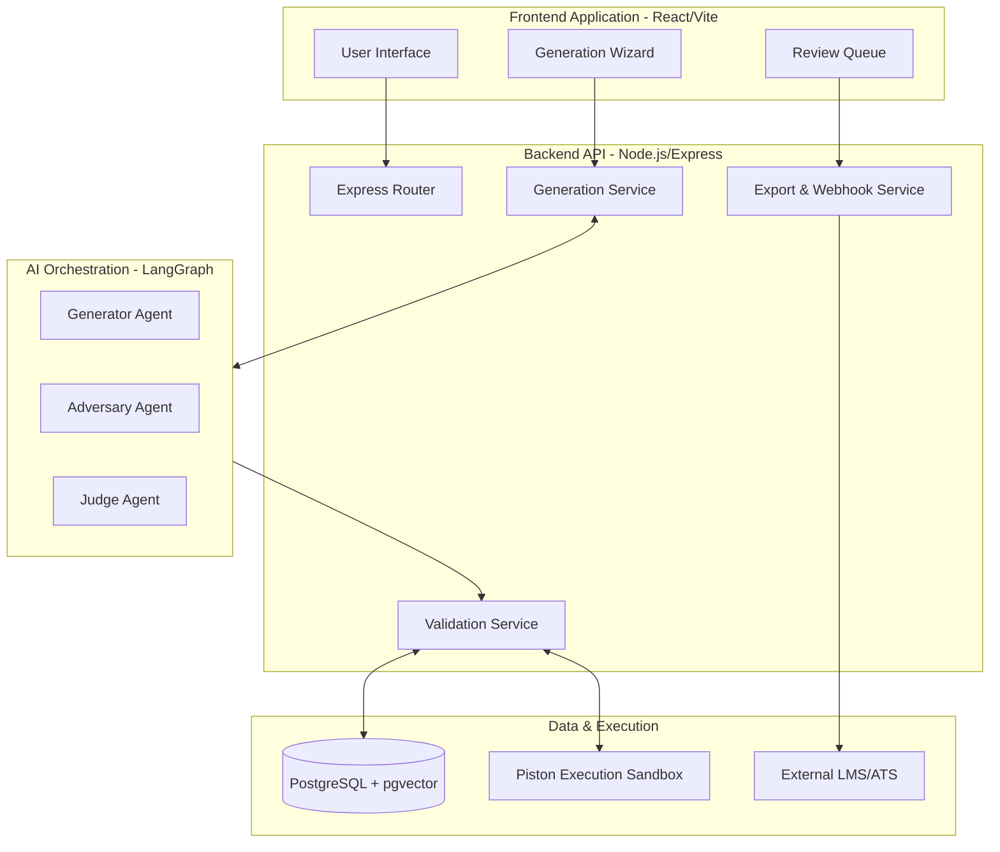
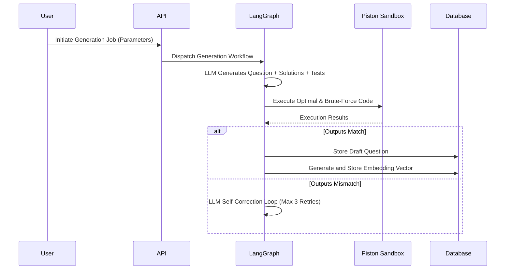
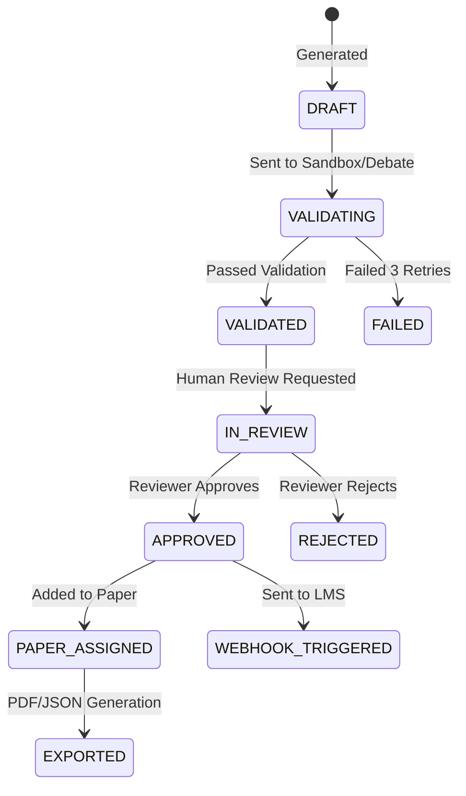
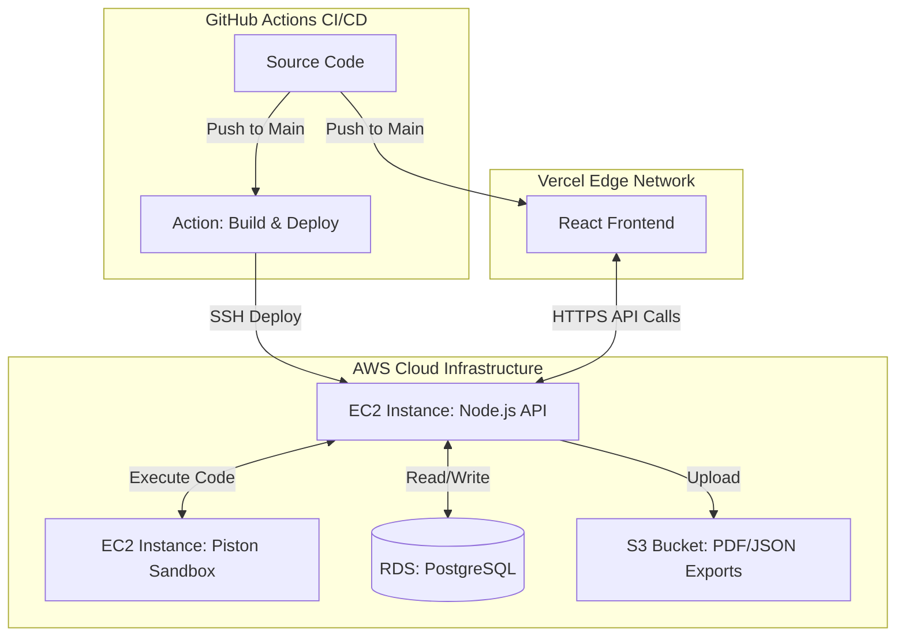

# Question Forge

**Enterprise-Grade AI Assessment Question Generator with Multi-Layer Validation**

Question Forge is an open-source platform designed for enterprise HR and university placement teams to generate, rigorously validate, and export technical interview questions (Data Structures and Algorithms, Object-Oriented Programming, System Design, SQL). It solves the core problem of AI-generated assessments: ensuring technical accuracy and avoiding ambiguous questions through an automated, multi-layer validation pipeline.

---

## Latest Updates

- **Ultra-Minimalist UI Overhaul**: Upgraded the frontend to a premium, pitch-black Vercel/Linear-inspired aesthetic with 1px structural borders and 150ms staggered micro-animations.
- **"Engineering Engine" Dashboard**: Completely redesigned the dashboard based on Figma AI outputs, featuring sparkline metrics, live "Recent Generations" tables, and glassmorphic quick-action panels.
- **LLM Provider Fallback Chain (BYOK)**: The engine now auto-detects any configured key — Anthropic Claude, OpenAI GPT-4o, or Google Gemini (free tier). Set any key in `.env` and it just works. No single provider dependency.
- **Cross-Model Adversarial Debate**: The Adversary Agent in the validation pipeline now deliberately uses a **different LLM** than the Generator to expose blind spots the generating model would miss.
- **Difficulty Calibration Constraints**: Strict algorithmic complexity requirements are now injected into every prompt — Easy must be O(n), Medium must use DP/two-pointers, Hard must use specialized data structures.
- **Chain of Thought (CoT) Pre-generation**: The LLM generation pipeline now strictly requires a `<thinking>` block to reason about edge cases and constraints before outputting the final JSON, drastically improving question quality.
- **Multi-Agent Reflection Loop**: Failed questions (e.g., failing the internal sandbox) are no longer discarded. The exact criticism and the failed draft are sent back to the LLM to self-correct in a Critic-Generator loop.
- **MCQ Generation**: Added robust support for generating Multiple Choice Questions with configurable distractor options.
- **Auto-Generate Assessment Papers**: Instantly draft a full assessment paper by specifying a title and desired question count, which automatically aggregates randomly selected, approved questions from your bank.

---

## High-Level Architecture



---

## What This Project Does

Question Forge provides an end-to-end pipeline for technical question creation:

1. **Parameter-Driven Generation**: Users configure target profiles (e.g., Senior Backend Engineer), topics, difficulty distribution, and programming languages. The platform estimates the token cost before generating the batch.
2. **Deterministic Code Validation**: For Data Structures and Algorithms (DSA) questions, the system generates both an optimal solution and a brute-force solution, along with over 20 test cases. It then executes both solutions in a securely isolated Docker sandbox to ensure outputs match perfectly.
3. **Adversarial Agent Validation**: For Object-Oriented Programming (OOPS) and conceptual questions, a LangGraph-powered adversarial debate is initiated. An Adversary Agent actively tries to find loopholes, ambiguity, or missing constraints in the generated question, while a Judge Agent makes the final determination on whether the question passes.
4. **Vector Deduplication**: Every approved question is embedded into a vector space using PostgreSQL and `pgvector`. New questions are compared against the existing bank using cosine similarity to prevent duplicates.
5. **Human-in-the-Loop Review**: Human reviewers are presented with a queue of only pre-validated questions. The interface highlights validation results, injected edge cases, and provides a streamlined approval process.
6. **Secure Export and Integration**: Approved questions can be organized into Papers and exported as raw JSON, watermarked Candidate PDFs, or Internal PDFs containing solutions. Alternatively, webhooks can be configured to push questions directly to an external Learning Management System (LMS) or Applicant Tracking System (ATS).

---

## Component Architecture and Data Flow

### 1. Generation and Validation Pipeline



### 2. OOPS Adversarial Debate


### 3. Review and Export Workflow



---

## Monorepo Structure

The repository is managed using npm workspaces, cleanly separating the frontend, backend, and modular internal packages.

* **apps/frontend**: React Single Page Application utilizing Vite, React Router, and React Query. Provides the user interface for all configuration and review tasks.
* **apps/api**: Node.js and Express REST API. Manages database connections, authentication, authorization, and exposes endpoints for the frontend.
* **packages/shared**: Contains the central Prisma schema, generated database client, and shared TypeScript types ensuring strict typing across the stack.
* **packages/ai-orchestration**: Encapsulates LangGraph workflows, defining the state machines for multi-agent generation and validation processes.
* **packages/sandbox**: A secure wrapper for communicating with the Piston code execution API.
* **packages/ingestion**: Adapters for parsing and normalizing questions scraped from external sources for ingestion into the question bank.

---

## Security Model

* **Execution Isolation**: The Piston code execution sandbox runs in a dedicated Docker network. It has no inbound or outbound internet access and cannot reach the PostgreSQL database or the main API.
* **Role-Based Access Control**: Strict enforcement of Administrator, Reviewer, and Generator roles at the API middleware layer.
* **Audit Logging**: Immutable audit logs track every question view, edit, approval, rejection, and export event.
* **Ephemeral Exports**: Generated PDF and JSON export URLs are signed and automatically expire after a configured duration (default 5 minutes).

---

## Deployment and Configuration

### Prerequisites
* Node.js (version 20 or higher)
* Docker and Docker Compose
* LLM Provider API Key (Anthropic or OpenAI)

### Running Locally

1. Clone the repository and configure the environment:
```bash
git clone https://github.com/your-org/question-forge.git
cd question-forge
cp .env.example .env
```

2. Add your required environment variables to `.env` (e.g., `DATABASE_URL`, `JWT_SECRET`, `ANTHROPIC_API_KEY`, `ENCRYPTION_KEY`).

3. Start the infrastructure components (Database and Sandbox):
```bash
docker-compose up -d postgres piston
```

4. Install dependencies and run database migrations:
```bash
npm install
npm run db:generate
npm run db:migrate
```

5. Start the development servers:
```bash
npm run dev
```

* Frontend Application: `http://localhost:5173`
* Backend API: `http://localhost:4000`

### Deploying to Production (AWS)

Question Forge follows the **12-Factor App** design principle, meaning it is completely infrastructure-agnostic. You can deploy it to your own AWS account without altering any code.



1. **Database**: Spin up an **AWS RDS PostgreSQL** instance and update your `.env` with the new `DATABASE_URL`.
2. **File Storage**: Create an **AWS S3 Bucket** for PDF/JSON exports and update `S3_BUCKET_NAME` and your IAM credentials in `.env`.
3. **Sandbox**: Deploy the Piston Docker image to an **AWS EC2** instance and point `PISTON_API_URL` to it.
4. **CI/CD Pipeline**: The repository includes a ready-to-use GitHub Actions workflow (`deploy-backend.yml`). Just add `EC2_HOST` and `EC2_SSH_KEY` to your GitHub secrets, and any push to `main` will automatically deploy the API to your EC2 instance.
5. **Frontend**: The React frontend can be hosted for free on **Vercel**, **Netlify**, or **AWS Amplify** by simply linking your GitHub repository.

---

## License

This project is licensed under the MIT License.
