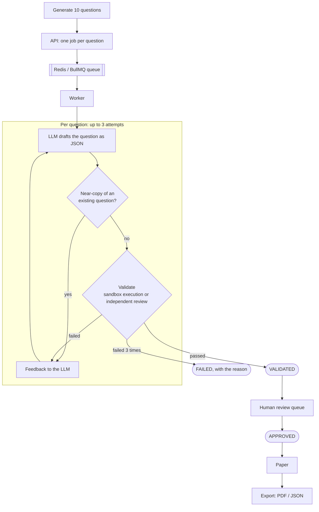

<div align="center">
  

  <br />
  <br />

  <h1>Question Forge</h1>
  <p><strong>Generates technical interview questions with an LLM — then checks them before a human ever sees them.</strong></p>

  <p>
    <a href="https://opensource.org/licenses/MIT"></a>
    <a href="https://github.com/yashsrivastava1408/QuestionForge/actions/workflows/ci.yml"></a>
    
    
    
    
    
    <a href="https://github.com/yashsrivastava1408/QuestionForge/pulls"></a>
  </p>
</div>

Question Forge drafts DSA, SQL, MCQ, OOP, conceptual and system-design questions for hiring assessments. An LLM writes each one; something other than that LLM then checks it. Coding and SQL questions are checked by **running code**. The rest are checked by an **independent LLM review**. Whatever passes goes to a human review queue, and approved questions are assembled into papers and exported.

An LLM is good at writing a plausible question and bad at knowing whether it is right. The whole design follows from not trusting what the model claims.

---

## Contents

- [What "validated" means](#what-validated-means)
- [How it works](#how-it-works)
- [Features](#features)
- [Project status — what is and is not verified](#project-status--what-is-and-is-not-verified)
- [Quick start](#quick-start)
- [Configuration](#configuration)
- [API reference](#api-reference)
- [Testing](#testing)
- [Production](#production)
- [Repository layout](#repository-layout)
- [Documentation](#documentation)
- [Not built yet](#not-built-yet)
- [Contributing](#contributing) · [License](#license)

---

## What "validated" means

It depends on the question type, and the app always says which one applied.

| Type | How it is checked | Is code executed? |
|---|---|:---:|
| **DSA** | Every solution, in every requested language, is run against a brute-force oracle on hand-written **and randomly generated** inputs. The statement's examples must match the executed output. On a maximum-size input the optimal solution must finish in 3 s and the brute force must be clearly slower. Then a second model writes its own solution **from the statement alone**, and that program must print the same answers. | ✅ |
| **SQL** | Two independently written queries run in SQLite on several datasets and must return the same rows. | ✅ |
| **MCQ / OOPS / Conceptual** | A second model answers the question **without seeing the answer key** and must land on it. Then an adversary looks for defects and a judge rules on them. | — |
| **OOPS / Conceptual that show code and ask for its output** | The draft must include a complete program. It is **run first**: its real output must equal the claimed output, be exactly the keyed option, and match no other option. A wrong key is rejected before any review call. The blind solve and adversary then run as above. | ✅ |
| **System design** | The grading rubric is checked for structure, then reviewed by an adversary and a judge. | — |

For the last two rows there is nothing to execute, so the result is an informed opinion, not a proof — which is why every question still goes through a human before it is used. The UI labels these "LLM-reviewed (not executed)" rather than implying more.

Details: [Generate → Validate → Retry Engine](./docs/architecture/multi-agent-debate.md) · [Sandboxed Execution & Differential Validation](./docs/architecture/sandboxed-execution.md)

---

## How it works


```mermaid
flowchart TD
    U["Generate 10 questions"] --> API["API: one job per question"]
    API --> Q[["Redis / BullMQ queue"]]
    Q --> W["Worker"]

    subgraph Loop ["Per question: up to 3 attempts"]
        G["LLM drafts the question as JSON"] --> D{"Near-copy of an\nexisting question?"}
        D -- yes --> FB["Feedback to the LLM"]
        D -- no --> V{"Validate\nsandbox execution or independent review"}
        V -- failed --> FB
        FB --> G
    end

    W --> G
    V -- passed --> OK(["VALIDATED"])
    V -- "failed 3 times" --> F(["FAILED, with the reason"])
    OK --> R["Human review queue"]
    R --> A(["APPROVED"]) --> P["Paper"] --> E["Export: PDF / JSON"]
```

When validation fails, the validator's report — for example *"Optimal solution (java) printed 0 but the brute force printed -1 on input …"* — is sent back to the model with its previous draft, and it tries again.

---

## Features

**Generation**
- One background job per question: questions in a batch run in parallel, and a crash or retry repeats one question, not the batch.
- Live progress for every question — the step it is on and, if it failed, why.
- Measured token usage and cost per batch (no estimates).
- Anthropic, OpenAI and Gemini; server-wide keys or each organization's own key, encrypted at rest.
- Duplicate detection against the organization's bank, including twins produced in the same batch.
- **Cancel** a running job, **retry only the failed questions** of a finished one, and browse **recent jobs**.
- A background sweeper recovers questions whose queue job was lost, so nothing stays "in progress" forever.

**Validation**
- Differential testing in Python, Java, C++ and JavaScript inside a Piston sandbox.
- Expected outputs come from execution, not from the model.
- A difficulty check: a "medium" or "hard" problem that brute force solves at maximum size is rejected.
- **Independent solver:** a second model solves each coding problem from the statement alone; if its program disagrees with the reference solutions, the statement is ambiguous or the solutions are wrong, and the draft is rejected.
- SQL validated by running two queries in SQLite.
- Questions that show code and ask for its output (OOPS, conceptual) have that code **executed** and the answer key checked against the real output.
- Blind-solve + adversarial review for non-executable questions, by a different provider when one is configured. It **fails closed**: an unreadable reviewer reply is never treated as a pass.

**Review and editing**
- Review queue with approve / reject — one at a time or **in bulk** — plus version history and an audit log.
- Reviewers can edit any part of a question. Editing its content sends it back through validation; it cannot be approved until it passes again.
- Import a problem statement from LeetCode or GeeksforGeeks as a draft, then have solutions and tests generated and validated for it. *(Imported statements belong to their source — see [the note on rights](./docs/architecture/ingestion-pipeline.md#rights-to-imported-content).)*

**Papers, export, integration**
- **Paper builder:** describe the paper as a blueprint ("2 easy DSA, 1 SQL, 5 MCQ") and it is drawn at random from approved questions, never the same one twice. Reorder or remove questions afterwards.
- Export candidate PDFs, internal PDFs (with answers and reference solutions) or JSON.
- Export to S3, or to local disk when S3 is not configured.
- HMAC-signed webhooks (`question.validated`, `question.approved`, `question.rejected`, `generation.completed`) with retries.

**Accounts**
- Users change their own password; admins add users, reset passwords, change roles, and deactivate or reactivate accounts.
- Deactivation, password changes and role changes take effect immediately: existing sessions are signed out.
- An organization's last admin cannot be removed.

**Analytics**
- Pass rate and average attempts per question type, measured spend, **cost per validated question**, the reasons questions fail, and the human approval rate.

**Operations**
- API and workers run as separate processes in production.
- Multi-tenant: every query is scoped to the caller's organization.
- Roles: Admin, Reviewer, Generator.
- Bull Board queue dashboard for admins.

---

## Project status — what is and is not verified

**Verified by tests in this repository**

- 181 unit tests across 5 workspaces. Those for the validation engine run **real** Python, JavaScript, C++, Java and SQLite programs.
- 49 end-to-end tests against a real Postgres, Redis, BullMQ queue and workers, with real code execution, webhook delivery and PDF export. Only the LLM is scripted.
- CI applies the migrations to a fresh database and runs both suites.

**Not verified — check these yourself before relying on it**

| | |
|---|---|
| Live LLMs | Only a small real run exists: Groq `openai/gpt-oss-120b` drafting with the local code runner, 10 questions (5 DSA in Python, 5 OOPS in Java) — 4 of 5 validated in each group (one DSA failed on a provider JSON error; one OOPS was rejected for not supplying a runnable program). Anthropic, OpenAI and Gemini have not been exercised by the pipeline, and no larger batch has been run. |
| Real Piston | The Piston client is tested with mocked HTTP; real-execution tests use a local process runner. |
| Browser | Frontend tests run in jsdom. Nothing drives the UI in a real browser. |
| Load | No load test has been run. There are no throughput numbers. |
| Docker / AWS | Compose files, Dockerfiles and Terraform were not built or applied as part of the latest changes. |

More in [Testing](./docs/operations/testing.md) and [Capacity Planning](./docs/operations/scalability-and-benchmarks.md).

---

## Quick start

**Needs:** Node 20+, npm 10+, Docker, and at least one LLM API key.

```bash
git clone https://github.com/yashsrivastava1408/QuestionForge.git
cd QuestionForge
cp .env.example .env
```

Edit `.env`:

```bash
ANTHROPIC_API_KEY=...          # and/or OPENAI_API_KEY, GOOGLE_GEMINI_API_KEY
JWT_SECRET=$(openssl rand -hex 32)
ENCRYPTION_KEY=$(openssl rand -hex 32)
```

Start the infrastructure, set up the database, run:

```bash
docker compose up -d postgres redis piston
npm install
npm run db:generate
npm run db:migrate:deploy
npm run db:seed
npm run dev
```

- App: http://localhost:5173
- API: http://localhost:4000
- Sign in with organization `demo`, `admin@demo.com` / `password123` (a reviewer account, `reviewer@demo.com`, has the same password). **Change these before exposing the app to anyone:** sidebar → *Change Password* for your own, Admin → *Team Members* to reset or deactivate others.

Piston starts with no languages installed. Install the runtimes once (see the [Piston CLI](https://github.com/engineer-man/piston#cli)): `python`, `java`, `gcc`, `node`, `sqlite3`.

### Without Piston

To try the pipeline without setting up Piston, add `SANDBOX_DRIVER=local` to `.env`. Generated code then runs as ordinary processes on your machine using your installed `python3`, `node`, `g++`, `javac` and `sqlite3`.

> ⚠️ **This runs LLM-written code with no isolation.** It is for local experiments only, and the app refuses to start with it when `NODE_ENV=production`.

### Skipping the login screen in development

Set `ALLOW_MOCK_AUTH=true` in `.env` **and** `VITE_ALLOW_MOCK_AUTH=true` for the frontend. This is off by default and ignored in production.

### Existing database?

If you already have a Question Forge database, read [Schema & Migrations → Applying them](./docs/database/schema-and-indexing.md#applying-them) before migrating. An earlier mismatch between the schema and its migrations is fixed by a new migration, and how you apply it depends on how your database was created.

---

## Configuration

The full list, with comments, is in [`.env.example`](./.env.example). The ones that matter most:

| Variable | Purpose | Default |
|---|---|---|
| `DATABASE_URL` | Postgres connection string | — |
| `REDIS_URL` | Redis for queues, rate limits, token revocation | `redis://localhost:6379` |
| `JWT_SECRET` | Signs login tokens. Production requires 32+ random characters. | — |
| `ENCRYPTION_KEY` | 64 hex chars. Encrypts webhook secrets and per-organization LLM keys. | — |
| `ANTHROPIC_API_KEY` / `OPENAI_API_KEY` / `GOOGLE_GEMINI_API_KEY` | Server-wide LLM keys. Configure two providers to get an independent reviewer. | — |
| `ANTHROPIC_MODEL` / `OPENAI_MODEL` / `GEMINI_MODEL` | Model overrides | `claude-opus-5-5` / `gpt-4o` / `gemini-flash-lite-latest` |
| `SANDBOX_DRIVER` | `piston` or `local` (unsafe, dev only) | `piston` |
| `PISTON_API_URL` | Piston endpoint | `http://localhost:2000` |
| `WORKER_CONCURRENCY` | Questions processed in parallel per worker | `5` |
| `SANDBOX_CONCURRENCY` | Parallel sandbox executions per validation | `10` |
| `VALIDATION_RANDOM_CASES` / `VALIDATION_EDGE_CASES` | Generated inputs per coding question | `12` / `4` |
| `VALIDATION_ENFORCE_COMPLEXITY_GAP` | Fail medium/hard questions that brute force can solve | `true` |
| `VALIDATION_BLIND_SOLVER` | Have a second model solve coding questions from the statement alone (one extra LLM call each) | `true` |
| `ANTHROPIC_REVIEW_MODEL` / `OPENAI_REVIEW_MODEL` / `GEMINI_REVIEW_MODEL` | A cheaper model for the short review calls | same as drafting |
| `OPENAI_BASE_URL` | Point the `openai` provider at any OpenAI-compatible API, e.g. Groq (`https://api.groq.com/openai/v1`) | OpenAI |
| `REVIEW_PROVIDER` | Pin which provider reviews drafts. Results are labelled same-provider if it equals the drafter | a different provider than the drafter, if one has a key |
| `LLM_PRICE_INPUT_PER_MTOK` / `LLM_PRICE_OUTPUT_PER_MTOK` | USD per million tokens, for providers without a built-in price; without them cost is shown as unknown | — |
| `ENABLE_EMBEDDED_WORKERS` | Run workers inside the API process | on in dev, off in prod |
| `EXPORT_STORAGE` / `EXPORT_LOCAL_DIR` | `local` to store exports on disk instead of S3 | S3 if configured |
| `S3_BUCKET_NAME`, `AWS_*` | S3 export storage | — |
| `LLM_PRICE_INPUT_PER_MTOK` / `LLM_PRICE_OUTPUT_PER_MTOK` | Your price per million tokens, for cost reporting on non-Claude models | — |
| `MAINTENANCE_INTERVAL_MINUTES` / `STALE_ITEM_MINUTES` | Housekeeping sweep: recover stuck questions, delete expired exports | `5` / `15` |
| `SUPERADMIN_EMAILS` | Emails allowed to create new organizations | none |
| `ALLOW_MOCK_AUTH` | Dev-only login shortcut | `false` |
| `WEBHOOK_ALLOW_PRIVATE_TARGETS` | Dev-only: allow webhooks to localhost | `false` |

With `NODE_ENV=production`, the API and worker **refuse to start** with a weak `JWT_SECRET`, a missing or all-zero `ENCRYPTION_KEY`, `ALLOW_MOCK_AUTH=true`, or `SANDBOX_DRIVER=local`.

---

## API reference

All endpoints except login, health and export download need `Authorization: Bearer <token>`. Everything is scoped to the caller's organization.

### Auth
| Method | Endpoint | Description | Who |
|---|---|---|---|
| `POST` | `/api/auth/login` | `{ email, password, organizationSlug }` → JWT | Public |
| `POST` | `/api/auth/register` | Create a user in **your own** organization | Admin |
| `POST` | `/api/auth/logout` | Revoke the current token | Any |
| `POST` | `/api/auth/change-password` | `{ currentPassword, newPassword }` — signs out your other sessions, returns a fresh token | Any |
| `GET` | `/api/auth/me` | Current user | Any |

There is no public sign-up. The first admin comes from `npm run db:seed`.

### Generation
| Method | Endpoint | Description | Who |
|---|---|---|---|
| `POST` | `/api/generate` | Start a batch. Returns `202 { jobId }`. | Admin, Generator |
| `GET` | `/api/generate/status/:jobId` | Per-question status, measured token usage and cost | Any |
| `GET` | `/api/generate/status/:jobId/stream` | The same, as Server-Sent Events | Any |
| `GET` | `/api/generate/jobs` | Recent batches with validated / failed counts | Any |
| `POST` | `/api/generate/jobs/:jobId/cancel` | Stop a running batch; validated questions are kept | Admin, Generator |
| `POST` | `/api/generate/jobs/:jobId/retry-failed` | Re-run only the failed questions of a finished batch | Admin, Generator |

<details>
<summary>Example request and status</summary>

```jsonc
// POST /api/generate
{
  "roleLevel": "intern",                     // intern (fresher) | sde1 | sde2 | senior | lead
  "topics": ["Arrays", "Graphs"],
  "difficultyDistribution": { "easy": 30, "medium": 50, "hard": 20 },   // must sum to 100
  "totalQuestions": 10,
  "questionTypes": ["DSA", "SQL", "MCQ"],    // DSA | SQL | MCQ | OOPS | CONCEPTUAL | SYSTEM_DESIGN
  "languages": ["python", "java"],           // python | java | cpp | javascript (DSA only)
  "llmProvider": "anthropic",                // anthropic | openai | gemini
  "companyStyle": "TCS NQT",                  // optional, free text (e.g. Infosys campus, Google-style)
  "mcqOptionsCount": 4,                      // optional
  "paperId": "…"                             // optional: attach validated questions to this paper
}
```

```jsonc
// GET /api/generate/status/:jobId
{
  "jobId": "…", "kind": "GENERATE", "state": "active", "progress": 40, "done": false, "total": 10,
  "counts": { "queued": 2, "running": 4, "validated": 3, "failed": 1 },
  "items": [
    { "index": 0, "type": "DSA", "difficulty": "MEDIUM", "topic": "Arrays",
      "status": "VALIDATING", "stage": "Sandbox: differential testing across 2 language(s)",
      "attempts": 1, "failureReason": null, "questionId": "…", "title": "…" }
  ],
  "usage": { "inputTokens": 48211, "outputTokens": 30954, "costUsd": 0.8119 }
}
```
</details>

### Questions
| Method | Endpoint | Description | Who |
|---|---|---|---|
| `GET` | `/api/questions` | List; filter by `status`, `type`, `difficulty`, `topic`; `page`, `limit` | Any |
| `GET` | `/api/questions/:id` | Full question with history and reviews | Any |
| `PATCH` | `/api/questions/:id` | Edit. A content change triggers re-validation and returns `revalidationJobId`. | Admin, Reviewer |
| `POST` | `/api/questions/:id/revalidate` | Run validation again | Admin, Reviewer |
| `POST` | `/api/questions/:id/complete` | For an imported draft: generate and validate solutions and tests | Admin, Generator |
| `POST` | `/api/questions/:id/review` | `{ decision: "APPROVED" \| "REJECTED", note? }` — only for `VALIDATED` questions | Admin, Reviewer |
| `POST` | `/api/questions/review-bulk` | `{ ids, decision, note? }` — up to 100 at once; returns `{ updated, skipped }` | Admin, Reviewer |

### Papers and export
| Method | Endpoint | Description | Who |
|---|---|---|---|
| `GET` | `/api/papers` · `/api/papers/:id` | List / read papers | Any |
| `POST` | `/api/papers` | `{ title, questionIds }` | Admin, Generator |
| `GET` | `/api/papers/availability` | Approved question counts per type and difficulty | Any |
| `POST` | `/api/papers/assemble` | `{ title, blueprint: [{ type?, difficulty?, topic?, count }] }` — random draw from approved questions | Admin, Generator |
| `PATCH` | `/api/papers/:id` | `{ title?, questionIds? }` — rename, reorder, add or remove | Admin, Generator |
| `POST` | `/api/export` | `{ paperId, format: "JSON" \| "PDF_CANDIDATE" \| "PDF_INTERNAL" }` → short-lived `downloadUrl` | Admin, Reviewer |
| `GET` | `/api/export/download/:token` | Download a locally stored export. The token is the credential. | Link holder |

### Import
| Method | Endpoint | Description | Who |
|---|---|---|---|
| `POST` | `/api/ingestion/fetch` | `{ platform: "leetcode" \| "gfg", slug, save? }` — preview, or save as a `DRAFT` | Admin |
| `POST` | `/api/ingestion/fetch-category` | Up to `limit` LeetCode problems for a tag | Admin |

### Admin
| Method | Endpoint | Description |
|---|---|---|
| `GET` | `/api/admin/users` | Users in the organization |
| `PATCH` | `/api/admin/users/:id/role` | Change a user's role |
| `PATCH` | `/api/admin/users/:id/status` | `{ isActive }` — deactivate or reactivate |
| `POST` | `/api/admin/users/:id/reset-password` | `{ newPassword }` — set a new password and sign the user out |
| `POST` | `/api/admin/organizations` | Create an organization (emails in `SUPERADMIN_EMAILS` only) |
| `GET` | `/api/admin/audit-logs` | Audit trail |
| `GET` · `PUT` | `/api/admin/llm-keys` | See which providers have a key; set or remove the organization's own key (write-only) |
| `GET` | `/api/admin/queues/stats` | Queue counts |
| `POST` | `/api/admin/queues/ticket` | One-time link to the Bull Board dashboard |
| `GET` · `POST` | `/api/webhooks` · `/api/webhooks/configure` · `/api/webhooks/test` | Webhook configuration |

### Other
| Method | Endpoint | Description |
|---|---|---|
| `GET` | `/api/analytics/overview` · `/api/analytics/validation-rate` | Question-bank metrics |
| `GET` | `/api/analytics/generation?days=30` | Pass rate and attempts per type, measured spend, cost per validated question, failure reasons, human approval rate |
| `GET` | `/health` · `/health/ready` | Liveness; readiness (Postgres + Redis) |

---

## Testing

```bash
npm test              # 181 unit tests; no database, Redis, Docker or LLM key needed
npm run test:e2e      # 49 end-to-end tests; needs a disposable Postgres and Redis
```

| Workspace | Tests | Covers |
|---|---:|---|
| `apps/api` | 129 | Validation engine and independent solver (real code execution), review logic, OOPS code-output verification, draft schemas, failure classification, crypto, SSRF guard, config checks |
| `packages/sandbox` | 13 | Piston client (mocked HTTP), local runner (real processes) |
| `packages/ai-orchestration` | 4 | The LangGraph retry state machine |
| `packages/ingestion` | 8 | LeetCode / GeeksforGeeks adapters |
| `apps/frontend` | 27 | Live job progress, SSE client, question detail and editing, paper builder and export, bulk review, change password, user actions, job history, analytics |

The end-to-end suite **truncates the database it is given**. Setup, and the full list of what each suite proves and does not prove, is in [docs/operations/testing.md](./docs/operations/testing.md).

---

## Production

```bash
docker compose -f docker-compose.yml -f docker-compose.prod.yml up -d
```

Runs the API (2 replicas, no embedded workers), a separate worker, and the frontend behind nginx. Before you deploy, read the [Deployment & Runbook](./docs/operations/deployment-and-runbook.md) — in short:

- Set a strong `JWT_SECRET` and `ENCRYPTION_KEY`, or the processes will not start.
- Apply migrations (`npm run db:migrate:deploy`) before starting new code. Back up first.
- Configure S3 for exports (replicas do not share a disk).
- Run Redis with `maxmemory-policy noeviction`.
- Keep the Piston sandbox on a network that cannot reach your database.
- Replace the seeded demo credentials.

The sandbox, not the LLM, is usually what limits throughput: a 4-language coding question is roughly 300 executions. See [Capacity Planning](./docs/operations/scalability-and-benchmarks.md).

Security controls and open items are listed in [Security Architecture](./docs/security/security-whitepaper.md).

---

## Repository layout

```text
apps/
  api/                        Express API + BullMQ workers
    src/
      index.ts                HTTP server          worker.ts   standalone worker process
      routes/  controllers/   HTTP layer
      middleware/             auth, rate limiting, error handling
      queues/                 generation + webhook queues and workers
      services/
        generationService.ts  batches, items, the per-question job
        validationService.ts  differential + SQL validation
        reviewService.ts      blind solve, adversary, judge
        maintenanceService.ts recover stuck items, delete expired exports
        llmService.ts         provider clients, retries, usage metering
        prompts.ts            one prompt per question type
        questionDrafts.ts     Zod schemas for LLM drafts
        deduplicationService.ts   pricing.ts   exportService.ts   s3Service.ts
      utils/                  crypto, urlSafety (SSRF), config checks, json
      __tests__/              unit tests, e2e/ suite, fixtures/
  frontend/                   React 18 + Vite SPA
    src/pages/                Generate, Questions, Review, Papers, Analytics, Admin
    src/components/           JobProgress, JobHistory, QuestionDetail, GenerationInsights,
                              ChangePassword, UserActions, LlmKeysPanel, AddUserForm, Layout
    src/lib/jobStream.ts      SSE client (fetch-based)

packages/
  shared/                     Prisma schema + migrations, shared TypeScript types
  ai-orchestration/           LangGraph generate → validate → retry state machine
  sandbox/                    executeSandbox: Piston client + local dev runner
  ingestion/                  LeetCode / GeeksforGeeks adapters

docs/                         Architecture, database, security, operations
infra/terraform/              AWS infrastructure (not exercised by tests)
docker-compose.yml            Local stack: Postgres, Redis, Piston, API, frontend
docker-compose.prod.yml       Production overrides: API replicas + separate worker
```

**Stack:** TypeScript · Node 20 · Express · Prisma + PostgreSQL 16 · Redis 7 + BullMQ · LangGraph · Anthropic / OpenAI / Gemini SDKs · Piston · Puppeteer · React 18 + Vite · Vitest · Turborepo

---

## Documentation

| | |
|---|---|
| [System Overview](./docs/architecture/system-overview.md) | Processes, stores and request flow |
| [Generate → Validate → Retry Engine](./docs/architecture/multi-agent-debate.md) | The loop and what each question type's validation proves |
| [Sandboxed Execution & Differential Validation](./docs/architecture/sandboxed-execution.md) | The five-step differential test; SQL validation |
| [Queue & Worker Engine](./docs/architecture/queue-and-worker-engine.md) | One job per question, status, retries, quotas |
| [Question Ingestion](./docs/architecture/ingestion-pipeline.md) | Importing and completing drafts |
| [Schema & Migrations](./docs/database/schema-and-indexing.md) | Models, indexes, applying migrations |
| [Duplicate Detection](./docs/database/vector-deduplication.md) | The lexical similarity check and its limits |
| [Security Architecture](./docs/security/security-whitepaper.md) | Controls and open items |
| [Deployment & Runbook](./docs/operations/deployment-and-runbook.md) | Required config, health probes, incident playbooks |
| [Testing](./docs/operations/testing.md) | What is tested and what is not |
| [Capacity Planning](./docs/operations/scalability-and-benchmarks.md) | A planning model; no measured benchmarks |

---

## Not built yet

- **Semantic duplicate detection.** Today's check is lexical: it catches reworded copies, not the same problem told as a different story. Real embeddings with a `pgvector` index are the next step.
- **Single sign-on** (SAML / OIDC), and a self-service "forgot password" email flow — today an admin resets a locked-out user's password.
- **Reviewer assignment.** Any reviewer can act on any question; there is no per-reviewer queue.
- **Shuffled paper variants** (per-candidate question or option order).
- **More languages.** Piston supports Go, Rust, C# and others; the prompts and UI cover Python, Java, C++ and JavaScript.
- **A candidate-facing test runner.** Question Forge produces and exports assessments; it does not deliver them to candidates.
- **Provider-native structured output.** Drafts are requested as JSON and checked with Zod, with a retry on a bad shape, rather than enforced by each provider's schema feature.
- **Load testing and published performance numbers.**

---

## Contributing

- [Contributing Guide](./CONTRIBUTING.md) — setup, branching, pull requests
- [Code of Conduct](./CODE_OF_CONDUCT.md)
- [Security Policy](./SECURITY.md) — reporting vulnerabilities

Please run `npm run lint`, `npm run typecheck` and `npm test` before opening a pull request, and update the relevant page under `docs/` when you change behaviour.

## License

MIT.
