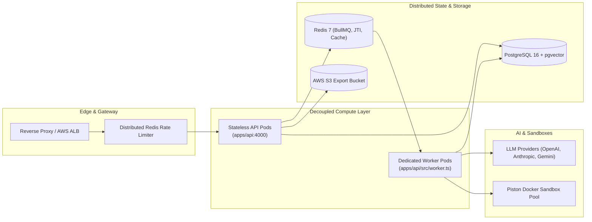

# Question Forge Enterprise Documentation

Welcome to the technical documentation hub for **Question Forge**, an enterprise-grade multi-agent AI orchestration platform engineered for technical question generation, sandboxed validation, and assessment lifecycle management.

This directory contains deep architectural specifications, data models, multi-agent workflows, security whitepapers, and operational runbooks intended for architects, systems engineers, security auditors, and DevOps teams.

---

## Documentation Index

### 1. Architecture Deep-Dives (`docs/architecture/`)
- [**System Architecture Overview**](./architecture/system-overview.md)
  *End-to-end distributed system topology, decoupled API vs. Worker processes, caching hierarchies, and fault tolerance.*
- [**Multi-Agent Adversarial Debate Pipeline**](./architecture/multi-agent-debate.md)
  *LangGraph state machines, Generator/Adversary/Judge agent roles, consensus scoring, and iterative self-correction loops.*
- [**Sandboxed Code Execution Engine**](./architecture/sandboxed-execution.md)
  *Piston Docker container isolation, security constraints, resource quotas, and differential testing between optimal and brute-force solutions.*
- [**Distributed Queue & Worker Engine**](./architecture/queue-and-worker-engine.md)
  *BullMQ and Redis 7 queue mechanics, job lifecycles, concurrency tuning, stalled job recovery, and graceful shutdown signal draining.*

### 2. Database & Vector Search (`docs/database/`)
- [**Database Schema, ERD & Indexing Strategy**](./database/schema-and-indexing.md)
  *PostgreSQL 16 relational data model, composite B-Tree indexes, multi-tenant partitioning patterns, and zero-drift Prisma migrations.*
- [**Vector Deduplication & Semantic Search**](./database/vector-deduplication.md)
  *Mathematical formulation of cosine similarity, FNV-1a feature hashing, `pgvector` IVFFlat indexing, and cross-assessment deduplication thresholds.*

### 3. Security & Governance (`docs/security/`)
- [**Enterprise Security Architecture Whitepaper**](./security/security-whitepaper.md)
  *Multi-tenant data isolation, stateless JWT + Redis JTI instant revocation blacklist, RBAC matrix, Zod mass-assignment protection, PDF XSS escaping, and HMAC-SHA256 webhook signatures.*

### 4. Operations & Scaling (`docs/operations/`)
- [**Production Deployment & SRE Runbook**](./operations/deployment-and-runbook.md)
  *Step-by-step production deployment on AWS (RDS, ElastiCache, S3, EC2/ECS), Terraform IaC instructions, zero-downtime rolling deploys, backup/restore, and incident troubleshooting.*
- [**Quantitative Scalability Specifications & Benchmarks**](./operations/scalability-and-benchmarks.md)
  *Empirical throughput analysis, Tier 3 Enterprise capacity benchmarks (50,000–250,000 questions/day), load testing protocols, and independent API vs. Worker autoscaling rules.*

---

## Architecture Summary Matrix

---

## Contributing to Documentation
When modifying architecture, queue contracts, or database schemas, ensure that the corresponding documentation in this directory is updated in the same pull request. All Mermaid diagrams must be tested for syntax correctness.
