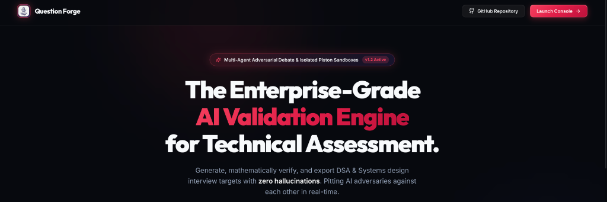
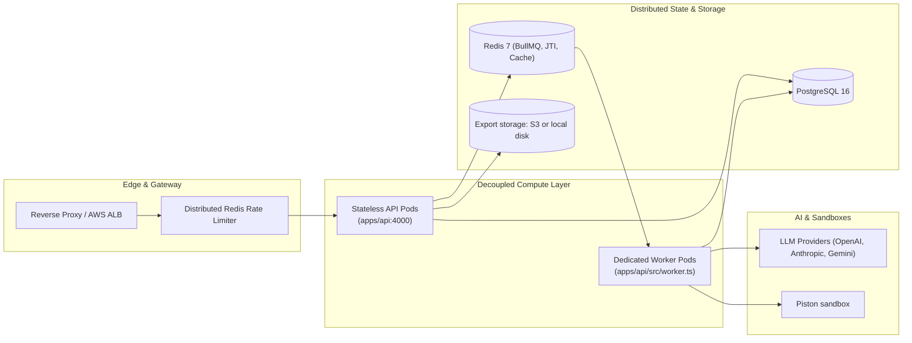

  

   
   

  <h1>Question Forge Documentation</h1>

Technical documentation for **Question Forge**: a tool that drafts technical interview questions with an LLM and then checks them — by running code where the question type allows it, and by independent LLM review where it does not — before a human approves them.

These pages describe what the code does today, including what it does not do. Where something is unverified or unbuilt, the page says so.

---

## Documentation Index

### Architecture (`docs/architecture/`)
- [**System Overview**](./architecture/system-overview.md)
  *Processes, data stores, and how a request flows through them.*
- [**Generate → Validate → Retry Engine**](./architecture/multi-agent-debate.md)
  *The LangGraph loop, what "validated" means for each question type, the blind-solve review, and why it fails closed.*
- [**Sandboxed Execution & Differential Validation**](./architecture/sandboxed-execution.md)
  *Sandbox drivers, the five-step differential test for coding questions, SQL validation by execution.*
- [**Queue & Worker Engine**](./architecture/queue-and-worker-engine.md)
  *One job per question, item lifecycle, live status and SSE, retries, quotas.*
- [**Question Ingestion**](./architecture/ingestion-pipeline.md)
  *LeetCode / GeeksforGeeks import, and turning an imported draft into a validated question.*

### Database (`docs/database/`)
- [**Schema & Migrations**](./database/schema-and-indexing.md)
  *Models, notable columns, indexes, and how to apply the migrations to an existing database.*
- [**Duplicate Detection**](./database/vector-deduplication.md)
  *The lexical similarity check, the in-batch twin check, and why semantic search is not built.*

### Security (`docs/security/`)
- [**Security Architecture**](./security/security-whitepaper.md)
  *Tenancy, authentication, roles, secrets at rest, webhook SSRF protection, the queue dashboard login, and the open items.*

### Operations (`docs/operations/`)
- [**Deployment & Runbook**](./operations/deployment-and-runbook.md)
  *Required configuration, migrations, health probes, incident playbooks.*
- [**Testing**](./operations/testing.md)
  *The unit and end-to-end suites, what each proves, and what is not tested.*
- [**Capacity Planning**](./operations/scalability-and-benchmarks.md)
  *What limits throughput and a model to plan with. Contains no load-test results — none have been run.*

---

## Architecture at a Glance

```mermaid
flowchart LR
    subgraph Ingress ["Edge & Gateway"]
        ALB["Reverse Proxy / AWS ALB"]
        RateLimit["Distributed Redis Rate Limiter"]
    end

    subgraph Compute ["Decoupled Compute Layer"]
        API["Stateless API Pods\n(apps/api:4000)"]
        Worker["Dedicated Worker Pods\n(apps/api/src/worker.ts)"]
    end

    subgraph State ["Distributed State & Storage"]
        Redis[("Redis 7 (BullMQ, JTI, Cache)")]
        PG[("PostgreSQL 16")]
        S3[("Export storage: S3 or local disk")]
    end

    subgraph ExternalEngine ["AI & Sandboxes"]
        LLM["LLM Providers (OpenAI, Anthropic, Gemini)"]
        Piston["Piston sandbox"]
    end

    ALB --> RateLimit --> API
    API --> Redis
    API --> PG
    Redis --> Worker
    Worker --> LLM
    Worker --> Piston
    Worker --> PG
    API --> S3
```

---

## Contributing to Documentation
When you change behaviour, update the page that describes it in the same pull request. Do not document numbers you have not measured or features that are not built — mark them as such instead.
