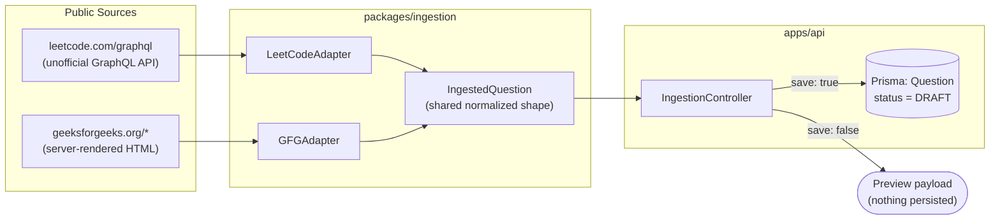
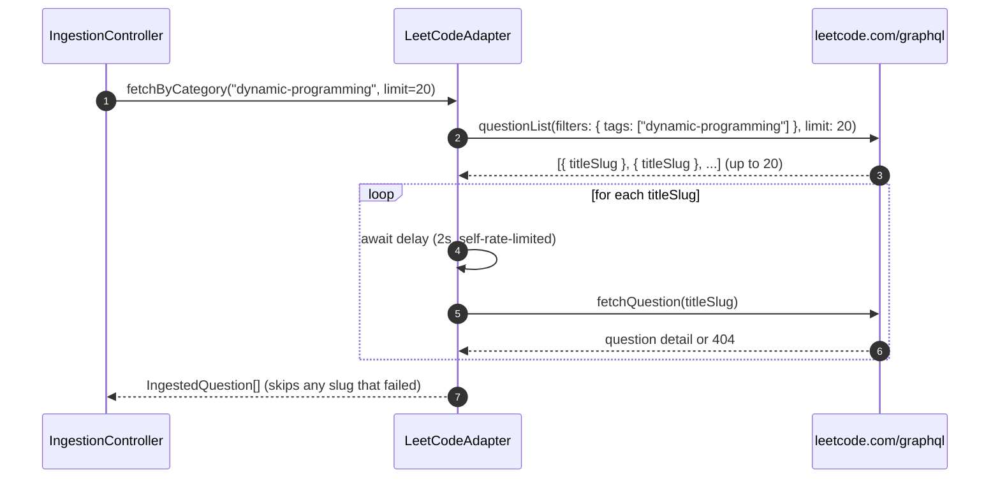
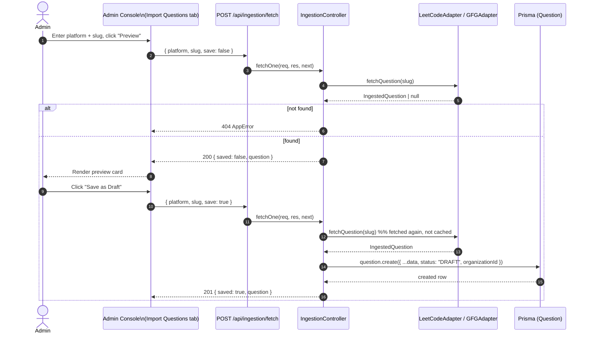
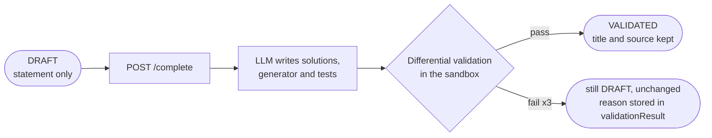

# Real-World Question Ingestion

This document specifies `packages/ingestion` and the `/api/ingestion/*` endpoints it backs — a way to seed the question bank with real, previously-published problems, distinct from the AI generation pipeline described in [`multi-agent-debate.md`](./multi-agent-debate.md).

---

## 1. Why This Is Separate From Generation

The LangGraph generate/validate pipeline produces a full question: statement, optimal and brute-force solutions, test cases, the works. Ingestion produces something more modest but genuinely useful: a **real problem statement and metadata**, scraped from a public source, with no solutions or test cases attached. It exists for the workflow where a reviewer wants to seed the bank from a known-good, already-vetted problem instead of trusting an LLM to invent one from scratch — the ingested row lands as a `DRAFT` question. `POST /api/questions/:id/complete` then has the LLM write solutions and tests for that statement and validates them in the sandbox (see §Completing a draft below).



Compared to generation, this pipeline is deliberately shallow — one hop from public HTML/GraphQL to a normalized shape to a `DRAFT` row, with no LLM, no sandbox, and no retry loop involved.

## 2. Adapters (`packages/ingestion/src/adapters/`)

Both adapters normalize their source into the same `IngestedQuestion` shape (`title`, `statement`, `difficulty`, `topic`, `tags`, `languages`, `sourceUrl`, `sourcePlatform`), so the controller and UI don't need to know which platform a question came from.

### `LeetCodeAdapter`
- `fetchQuestion(titleSlug)` — POSTs a GraphQL query to `leetcode.com/graphql`, strips HTML from the returned `content` field, maps LeetCode's `Easy/Medium/Hard` to this app's `EASY/MEDIUM/HARD`, and self-rate-limits with a configurable delay (2s by default; the constructor accepts an override, used in tests to run instantly).
- `fetchByCategory(category, limit)` — runs LeetCode's `questionList` GraphQL query filtered by tag, then calls `fetchQuestion` once per resulting slug. A failed list query degrades to an empty array rather than throwing; a failure on an individual slug is simply skipped.

### `GFGAdapter`
- `fetchQuestion(slug)` — fetches the GeeksforGeeks article HTML directly and parses it with Cheerio (`$('h1')` for the title, the first few `.entry-content p` paragraphs for the statement). No list/category endpoint — GFG doesn't expose one publicly the way LeetCode's GraphQL API does.

Both adapters return `null` (never throw) on a 404, a network error, or an unparseable response — the controller turns that into a normal 404, not a 500.

### `fetchByCategory` in detail

The only multi-question path is LeetCode's, and it's two sequential network stages, not one:



A 20-item category fetch therefore takes roughly 20 × 2s ≈ 40 seconds end-to-end — that's the deliberate trade-off for not getting rate-limited by an unofficial API, not an oversight; the endpoint is meant for occasional bulk seeding, not a hot path.

## 3. API Surface (`apps/api/src/controllers/ingestionController.ts`)

| Endpoint | Body | Behavior |
|---|---|---|
| `POST /api/ingestion/fetch` | `{ platform: "leetcode" \| "gfg", slug, save?: boolean }` | Fetches one question. `save: false` (default) returns a preview only; `save: true` persists it as `status: "DRAFT"`, scoped to the caller's `organizationId`. |
| `POST /api/ingestion/fetch-category` | `{ platform: "leetcode", category, limit?: number, save?: boolean }` | Same preview/save split, batched — LeetCode only, since GFG has no list endpoint. |

Both routes require `authenticate` + `authorize('ADMIN')` — ingestion is an administrative bulk-loading action, not a per-user one. Validation is Zod-based (`fetchOneSchema`/`fetchCategorySchema`), matching the rest of the controller layer's conventions.



Note the "Save as Draft" step re-fetches from the source rather than trusting the previewed payload round-tripped through the browser — a deliberate choice: the server is always the one deciding what actually gets persisted, not the client.

## 4. Frontend

The Admin console's **Import Questions** tab (`apps/frontend/src/pages/AdminPage.tsx`) is a thin client over the two endpoints above: pick a platform, enter a slug, **Preview** (calls with `save: false`), review the fetched statement, then **Save as Draft** (calls again with `save: true`). It deliberately doesn't call `fetch-category` from the UI yet — the endpoint exists and is tested, but a bulk-import review UI (letting an admin pick which of N fetched questions to keep) is a natural follow-up rather than something built speculatively ahead of a need.

## 5. What This Does Not Do

- Ingestion itself does not generate solutions or test cases — an ingested question is a `DRAFT` with a statement and metadata only until it is completed.
- It does not deduplicate against the existing question bank the way the generation pipeline does (see [`vector-deduplication.md`](../database/vector-deduplication.md)) — nothing currently stops the same LeetCode problem from being ingested twice. Wiring `checkDuplicate` into `persistAsDraft` is a small, scoped addition if that becomes a real problem.
- It respects LeetCode's rate limits by design (2s delay between requests) but is still hitting an unofficial API — treat it as best-effort, not an SLA-backed integration.

---

## Completing a draft

An imported draft has no solutions, so it cannot be validated or reviewed as it is. In the Question Bank, open the draft and choose **Generate & validate solutions**, or call:

```
POST /api/questions/:id/complete        (ADMIN or GENERATOR)
{ "llmProvider": "anthropic", "languages": ["python", "java"] }   // both optional
→ 202 { "jobId": "…", "statusUrl": "/api/generate/status/…" }
```

This queues a one-item `COMPLETE_IMPORT` job that runs the normal generate → validate loop with one difference: the prompt contains the imported statement and tells the model **not to change what it asks**, only to pin down an exact stdin/stdout format and write the optimal solution, brute force, input generator and test cases.



- The draft row is only overwritten once the result has passed validation. A failed completion leaves it exactly as imported.
- Only coding (`DSA`) drafts can be completed this way.
- If no LLM key is available the request is refused with `400` straight away.

## Rights to imported content

Problem statements on LeetCode and GeeksforGeeks belong to those platforms. Fetching one does not give you the right to reuse it in your own assessments. Every ingestion response carries a `notice` saying so, and the UI shows a warning on imported questions. Treat imports as internal reference material unless you have confirmed you may use them; the tool cannot check that for you. Scraping may also be against a site's terms of service.
