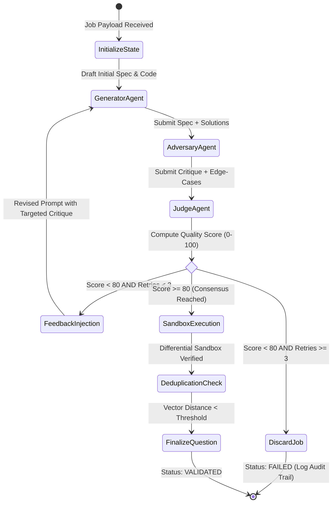

# Multi-Agent Adversarial Debate Pipeline

This document provides a technical specification of the **LangGraph-powered multi-agent adversarial debate system** used in Question Forge to generate, critique, and validate high-stakes technical coding assessments.

---

## 1. The Fallacy of Single-Shot LLM Generation

In conventional AI applications, question generation relies on a single prompt:
$$\text{Prompt} \longrightarrow \text{LLM} \longrightarrow \text{Question Output}$$

Empirical testing across thousands of technical interview problems reveals severe failure modes when using single-shot prompts:
1. **Hallucinated Edge-Case Tests**: LLMs often generate test assertions where the expected output does not mathematically match the problem specification.
2. **Hidden Constraint Contradictions**: E.g., specifying $1 \le N \le 10^5$ with an $O(N^2)$ algorithm, or stating "array is sorted" while test cases contain unsorted inputs.
3. **Mismatched Reference Implementations**: The "optimal" solution and "brute-force" solution compute divergent outputs on boundary cases (empty inputs, single elements, negative integers, 64-bit integer overflow).

To solve this, Question Forge implements a **Multi-Agent Adversarial Debate Loop** governed by a state machine.

---

## 2. Multi-Agent Topology & State Graph



---

## 3. Agent Roles & Prompt Engineering Contracts

### Agent 1: The Generator Agent
- **Objective**: Synthesize a comprehensive problem specification, optimal solution, brute-force baseline, and initial test matrix.
- **Contract Outputs**:
  - `title`: Concise, industry-standard algorithmic problem title.
  - `statement`: Clear narrative description including input format, output format, and concrete examples with walkthrough explanations.
  - `constraints`: Mathematical bounds (e.g., $N \le 2 \times 10^5$, $-10^9 \le A[i] \le 10^9$, Time Limit: $1.0\text{s}$, Space Limit: $256\text{MB}$).
  - `optimalSolution`: Time- and space-optimal code (e.g., $O(N \log N)$) across supported languages.
  - `bruteForceSolution`: Simple, demonstrably correct reference implementation (e.g., $O(N^2)$) used for differential testing.
  - `testCases`: Minimum 10 baseline test cases formatted as JSON `{ input, expectedOutput }`.

### Agent 2: The Adversary Agent
- **Objective**: Actively attempt to break the problem, identify ambiguities, and expose edge-case blind spots.
- **Audit Checklist**:
  - **Boundary Cases**: Empty collections, zero values, negative numbers, extreme values ($2^{31}-1$).
  - **Algorithmic Traps**: Does the optimal solution risk recursion stack overflow? Does it handle hash collisions or duplicate keys?
  - **Constraint Realism**: Can the brute force pass within time limits? Does the optimal solution strictly require the stated complexity?
  - **Language Portability**: Are there language-specific caveats (e.g., integer division rounding in Python vs. C++, array resizing in Java)?

### Agent 3: The Judge Agent
- **Objective**: Impartially evaluate the dialogue between Generator and Adversary against a quantitative rubric.
- **Scoring Rubric (100 Points Total)**:
  - **Algorithmic Soundness (30 pts)**: Mathematical correctness of the optimal approach.
  - **Edge-Case Completeness (25 pts)**: Coverage of boundary inputs.
  - **Specification Clarity (25 pts)**: Precision of constraints, input/output contracts, and explanation.
  - **Code Quality & Idioms (20 pts)**: Readability, variable naming, and idiomatic syntax across languages.
- **Decision Engine**:
  - If $\text{Score} \ge 80$: **Approve** $\to$ Advance to Sandbox.
  - If $\text{Score} < 80$: **Reject** $\to$ Construct targeted feedback payload containing the Adversary's findings, increment retry counter, and loop back to the Generator.

---

## 4. State Schema & Feedback Injection

The LangGraph state is strictly typed using TypeScript interfaces:

```typescript
export interface AgentDebateState {
  topic: string;
  difficulty: 'EASY' | 'MEDIUM' | 'HARD';
  targetLanguages: string[];
  retryCount: number;
  maxRetries: number;
  
  // Generator Outputs
  draftTitle?: string;
  draftStatement?: string;
  draftConstraints?: string[];
  optimalCode?: Record<string, string>;
  bruteForceCode?: Record<string, string>;
  testCases?: Array<{ input: any; expectedOutput: any; isHidden: boolean }>;
  
  // Adversary Critique
  adversaryNotes?: string[];
  suggestedEdgeCases?: Array<{ input: any; expectedOutput: any; reason: string }>;
  
  // Judge Assessment
  judgeScore?: number;
  judgeFeedback?: string;
  isApproved: boolean;
}
```

### Self-Correction Prompt Mechanics
When a revision is triggered, the Generator receives its prior output accompanied by the critique:

```text
SYSTEM: You are the Generator Agent. Your previous problem draft was evaluated by the Judge Agent with a score of 65/100 (Threshold: 80).

ADVERSARY CRITIQUE:
1. The problem statement does not clarify how to handle duplicate values in the input array.
2. The optimal solution uses a naive recursion that will throw RangeError on inputs where N > 5000.
3. Test case 4 has an incorrect expected output: for input [-3, -1, -5], the expected answer is -1, but your draft stated 0.

INSTRUCTION: Revise the problem statement to explicitly specify duplicate handling, refactor the optimal solution to an iterative O(N) dynamic programming approach, and correct the test case.
```

---

## 5. Transition to Physical Execution

Once the Judge Agent issues an approval ($\text{Score} \ge 80$), the generated problem payload is dispatched to the **Piston Sandbox Execution Pool**. 

The debate guarantees **semantic and conceptual validity**; the sandbox guarantees **syntactic and runtime execution validity** across all target compilers and interpreters.
