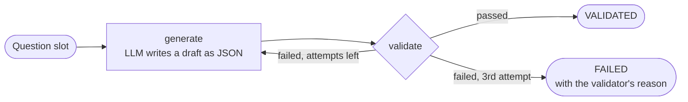
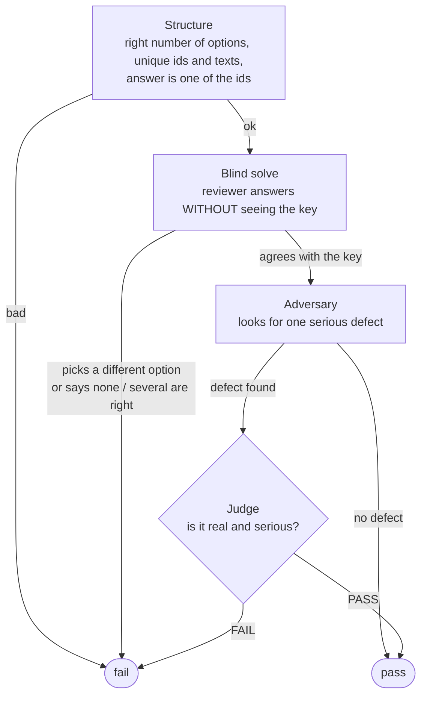

# Generate → Validate → Retry Engine

How one question goes from "requested" to `VALIDATED` or `FAILED`, and exactly what "validated" means for each question type.

---

## 1. The idea

An LLM is good at writing a plausible question and bad at knowing whether it is correct. So nothing the model *claims* is trusted. Every draft is checked by something other than the model that wrote it, and when the check fails, the checker's report goes back to the model for another attempt.

```mermaid
flowchart LR
    S(["Question slot"]) --> G["generate\nLLM writes a draft as JSON"]
    G --> V{"validate"}
    V -- "passed" --> OK(["VALIDATED"])
    V -- "failed, attempts left" --> G
    V -- "failed, 3rd attempt" --> F(["FAILED\nwith the validator's reason"])
```

The loop is a real `@langchain/langgraph` `StateGraph` in `packages/ai-orchestration/src/graphs/generateValidateGraph.ts`. It has two nodes (`generate`, `validate`) and one conditional edge. The graph knows nothing about LLMs, databases or sandboxes — `apps/api/src/services/generationService.ts` injects both nodes as plain async functions, which is why the graph can be unit-tested with no network.

- Maximum attempts: **3** (`MAX_ATTEMPTS`).
- One `Question` row per slot, however many attempts it takes. Retries update that row.
- On a retry the prompt contains the previous draft **and the validator's report** (for example: `Optimal solution (java) printed "0" but the brute force (python) printed "-1" on input …`).

## 2. `generate`

`buildDraftPrompt` (`services/prompts.ts`) builds a different prompt per question type, and `completeJson` (`services/llmService.ts`) sends it and checks the reply:

1. The reply must contain one JSON object (markdown fences and stray prose around it are tolerated).
2. That object must match the Zod schema for the type (`services/questionDrafts.ts`).
3. A reply that was cut off at the token limit, or refused, is rejected.

A reply that fails any of these is **not** a crash: it becomes feedback ("Reply did not match the required JSON shape — testCases: at least 6 test cases are required") and the model tries again. A provider outage (429/5xx/network) is different: it is retried with backoff, and if it persists the whole job is retried by the queue (see [queue-and-worker-engine.md](./queue-and-worker-engine.md)).

Each prompt is also given up to 40 titles that already exist in the organization for that type, with the instruction not to repeat them.

## 3. `validate` — what is actually checked

| Question type | Method (stored as `validationResult.method`) | What proves it |
|---|---|---|
| `DSA` | `sandbox_differential` | Code is **executed** against a brute-force oracle, then a second model writes its own solution **from the statement alone** and that is executed too. See [sandboxed-execution.md](./sandboxed-execution.md). |
| `SQL` | `sandbox_sql` | Two independently written queries are **executed** in SQLite on ≥ 2 datasets and must return the same rows. |
| `MCQ`, `OOPS`, `CONCEPTUAL` | `llm_review` | Structure checks → **blind solve** → adversarial review. Not executed. |
| `SYSTEM_DESIGN` | `llm_review` | Rubric structure checks → adversarial review. Not executed. |

Before any of this, a draft is rejected if its statement is a near-copy of an existing question (see [vector-deduplication.md](../database/vector-deduplication.md)).

The result records honestly which method ran. For `llm_review` questions the execution stages (`optimalSolutionPassed`, `crossCheckPassed`, …) are `false`, not "passed by default", and the UI labels them "LLM-reviewed (not executed)".

### 3.1 MCQ-style review (`services/reviewService.ts`)

```mermaid
flowchart TD
    A["Structure\nright number of options, unique ids and texts,\nanswer is one of the ids"] -->|ok| B["Blind solve\nreviewer answers WITHOUT seeing the key"]
    A -->|bad| X(["fail"])
    B -->|"picks a different option\nor says none / several are right"| X
    B -->|"agrees with the key"| C["Adversary\nlooks for one serious defect"]
    C -->|"no defect"| P(["pass"])
    C -->|"defect found"| J{"Judge\nis it real and serious?"}
    J -->|PASS| P
    J -->|FAIL| X
```

- The **blind solve** is the check that catches a wrong or ambiguous answer key: a second model that cannot see the key must land on it.
- If the blind solver agrees with the key but says another option is "also defensible", that concern is sent to the judge.
- The reviewer is a **different provider** than the generator whenever a second provider has a key (`getReviewerLLMClient`). Review calls can use a cheaper model via `ANTHROPIC_REVIEW_MODEL` / `OPENAI_REVIEW_MODEL` / `GEMINI_REVIEW_MODEL`. If only one provider is configured the review still runs, but the result is stored with `crossModel: false` and the details say "Same-model review".

### 3.2 It fails closed

A reviewer reply that cannot be parsed is retried once. If it is still unusable, the call **throws** — it is never turned into a pass. The job is retried; if the reviewer stays unusable the question ends up `FAILED`. (Earlier versions defaulted to PASS when the judge's reply could not be parsed.)

## 4. After the loop

| Outcome | What is written |
|---|---|
| Passed | `status: VALIDATED`, `validationResult`, test cases with **executed** expected outputs, the question is attached to `paperId` if one was given, a `question.validated` webhook is queued. |
| Failed after 3 attempts | `status: FAILED`, `validationResult` with the last report, the similarity vector is cleared so the failed draft cannot block later ones as a "duplicate". |
| No usable draft at all | No question row. The item is `FAILED` with the reason. |

## 5. What this does not guarantee

- **`llm_review` is still an LLM's opinion.** The blind solve makes a wrong answer key much less likely; it does not make it impossible. These questions need the human review step.
- **The independent solver narrows, but does not close, the statement gap.** Differential testing alone only proves the two reference solutions agree with each other; they were written by the same model and can share a misreading. The independent solver (a second model, statement only) catches that when it reads the statement differently. If both models misread it the same way, nothing catches it — and with a single LLM provider configured, the "second" model is the same one.
- **The prompts have only been exercised with a scripted model in the test suite.** They have not been tuned against live providers; expect to adjust them once you see real pass rates.
