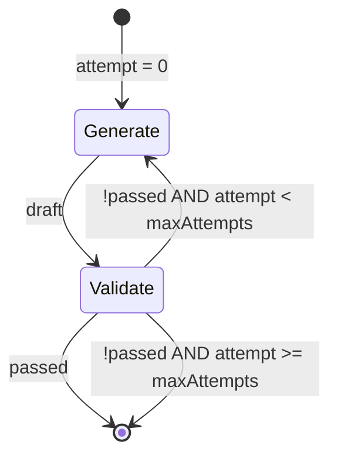

# LangGraph Generate → Validate → Retry Engine

This document specifies the real state machine that drives every question through Question Forge — implemented with `@langchain/langgraph`'s `StateGraph`/`Annotation` API in `packages/ai-orchestration`, and driven by concrete LLM/sandbox implementations in `apps/api`.

---

## 1. The Fallacy of Single-Shot LLM Generation

Relying on a single prompt —
$$\text{Prompt} \longrightarrow \text{LLM} \longrightarrow \text{Question Output}$$
— fails in predictable ways: hallucinated test assertions whose expected output doesn't match the problem, hidden constraint contradictions (stating $O(n)$ while the "optimal" solution is $O(n^2)$), and optimal/brute-force reference implementations that silently diverge on boundary cases.

Question Forge addresses this with a **generate → validate → retry** loop instead of a single-shot call.

---

## 2. The Real Graph: `packages/ai-orchestration/src/graphs/generateValidateGraph.ts`

There is exactly one `StateGraph` definition. Both `runDsaGenerationGraph` and `runOopsDebateGraph` (the two names the rest of the codebase and this doc's prior version referred to) are thin, differently-typed wrappers around the same compiled graph — they exist as two names because DSA and OOPS questions are validated completely differently, not because there are two engines.

```typescript
const GraphState = Annotation.Root({
  maxAttempts: Annotation<number>,
  attempt: Annotation<number>({ reducer: (_prev, next) => next, default: () => 0 }),
  draft: Annotation<unknown>({ reducer: (_prev, next) => next, default: () => null }),
  feedback: Annotation<string | null>({ reducer: (_prev, next) => next, default: () => null }),
  passed: Annotation<boolean>({ reducer: (_prev, next) => next, default: () => false }),
  validation: Annotation<unknown>({ reducer: (_prev, next) => next, default: () => null }),
});

new StateGraph(GraphState)
  .addNode('generate', /* calls the injected generate() */)
  .addNode('validate', /* calls the injected validate() */)
  .addEdge(START, 'generate')
  .addEdge('generate', 'validate')
  .addConditionalEdges('validate', (state) =>
    state.passed || state.attempt >= state.maxAttempts ? END : 'generate'
  )
  .compile();
```

The package itself never calls an LLM, a database, or the sandbox — `generate` and `validate` are plain async functions injected by the caller. That keeps `packages/ai-orchestration` unit-testable with mocked functions and zero network access (see `generateValidateGraph.test.ts`, 4 tests covering first-attempt pass, feedback-driven retry, exhausting `maxAttempts`, and both named wrappers sharing the engine), and lets `apps/api/src/services/generationService.ts` supply the real work.


```mermaid
stateDiagram-v2
    [*] --> Generate: attempt = 0
    Generate --> Validate: draft
    Validate --> [*]: passed
    Validate --> Generate: !passed AND attempt < maxAttempts
    Validate --> [*]: !passed AND attempt >= maxAttempts
```

---

## 3. What `generate` Actually Does

`generationService.ts` injects a `generate` function that calls the configured LLM provider (`llmService.ts` — Anthropic, OpenAI, or Gemini, selected per organization) with a prompt built by `buildDSASystemPrompt` or `buildOOPSSystemPrompt`. On a retry (`attempt > 0`), the previous draft and the `feedback` string from the failed `validate` call are folded into the prompt as a "REVISION REQUEST" section, so the model is doing targeted repair, not blind regeneration.

If the LLM call itself throws (rate limit, timeout, malformed JSON), `generate` catches it, backs off (`(attempt + 1) * 5000`ms), and returns a sentinel draft that `validate` short-circuits on — this still consumes one of the `maxAttempts` retries, but never writes a database row for a pure API failure.

## 4. What `validate` Actually Does (Two Different Strategies)

`validate` first runs the same feature-hashed deduplication check regardless of question type (see [`vector-deduplication.md`](../database/vector-deduplication.md)) — a duplicate is treated as a validation failure and fed back as feedback. Past that:

### DSA: Sandbox Differential Testing
`runValidationPipeline` → `_validateDSA` executes the optimal **and** brute-force solutions, for every configured language, against the test suite (plus deterministically injected edge cases from `edgeCaseService.ts`), in parallel through `packages/sandbox`'s Piston client. It passes only if every optimal-solution run matches its expected output *and* matches the brute-force run's output (differential testing) — see [`sandboxed-execution.md`](./sandboxed-execution.md).

### OOPS / Conceptual: Cross-Model Adversary + Judge Debate
`runValidationPipeline` → `_validateConceptual` calls `runAdversarialDebate` (`apps/api/src/services/agentDebateService.ts`), which is real and running, but simpler than earlier drafts of this document claimed:

1. **Adversary** — a prompt sent to a *different* LLM provider than the one that generated the draft (e.g. generated with Anthropic → critiqued with OpenAI), asked to find any ambiguity, factual error, or bad distractor option. Returns `{ foundIssue, issue, severity }`.
2. **Judge** — a second prompt (on the best available provider) given the Adversary's finding and asked for a binary decision: `{ decision: "PASS" | "FAIL", reasoning }`. The rule of thumb it's instructed to apply: lean PASS on a `minor` finding unless genuinely misleading, lean FAIL on a `major` one unless the Adversary is clearly wrong, and always PASS when the Adversary found nothing.

This is a **binary PASS/FAIL decision with a text report**, not a numeric 0–100 rubric score — if you want a scored rubric, that's a real, scoped enhancement to `agentDebateService.ts`'s Judge prompt and response parsing, not something to assume is already there.

If only one LLM provider is configured, the Adversary falls back to the same provider as the generator (logged as a warning) rather than failing outright — cross-model disagreement is the design goal, not a hard requirement.

---

## 5. Retry Semantics, End to End

`generationService.ts` runs one `(difficulty, type)` slot per graph invocation, `maxAttempts: 3`. A single Prisma `Question` row is created on the first attempt and **updated in place** on every retry — earlier versions of this pipeline created a new row per attempt and only updated the final one, leaving failed intermediate attempts stuck at `VALIDATING` forever; that bug is fixed by having every `validate` call write to the same row via a `questionId` captured in closure.

On the last exhausted attempt, the row is marked `FAILED` with whatever validation detail was last produced. On success, it's marked `VALIDATED`, its embedding is stored, and a `question.validated` webhook fires.
