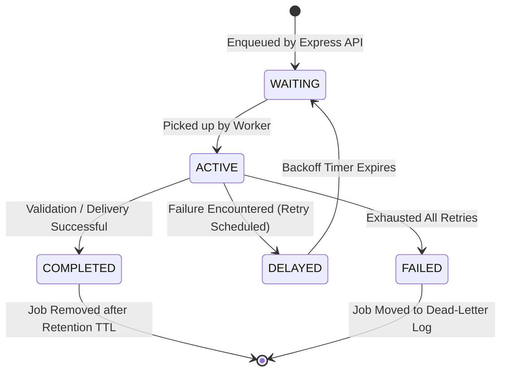

# Distributed Queue & Worker Engine

This document provides an in-depth reference for the **BullMQ and Redis 7 asynchronous job queue infrastructure** powering Question Forge.

---

## 1. Queue Architecture & Separation of Concerns

Question Forge operates **two independent BullMQ queues**, ensuring that high-latency AI generation jobs do not delay critical time-sensitive operations like customer webhook notifications:

```mermaid
flowchart TD
    subgraph Senders ["Job Producers (Express API Replicas)"]
        GenRoute["POST /api/generate"]
        ReviewRoute["POST /api/questions/:id/review"]
        ExportRoute["POST /api/export/:paperId"]
    end

    subgraph RedisQueues ["Redis 7 Queue Cluster"]
        Q_Gen[("BullMQ Queue: 'generation'\n- Priority: High / Normal\n- Payload: Topic, Diff, Langs, OrgId")]
        Q_Hook[("BullMQ Queue: 'webhooks'\n- Payload: Event, OrgId, Target URL, Secret")]
    end

    subgraph WorkerPool ["Dedicated BullMQ Worker Processes (worker.ts)"]
        W_Gen["generationWorker\n- Concurrency: 5–15\n- Runs LangGraph + Piston\n- Streams SSE Progress"]
        W_Hook["webhookWorker\n- Concurrency: 10\n- Signs HMAC-SHA256\n- 5-Tier Exponential Backoff"]
    end

    GenRoute -->|add(jobData)| Q_Gen
    ReviewRoute & ExportRoute -->|enqueueWebhook(payload)| Q_Hook

    Q_Gen -->|Fetch next job| W_Gen
    Q_Hook -->|Fetch next job| W_Hook
```

---

## 2. Job Lifecycles & State Transitions

BullMQ jobs transition through strict deterministic states:



### Stalled Job Detection & Lock Renewal
When a worker picks up a job:
1. It acquires a Redis lock with a default lock duration (30,000ms).
2. The worker automatically runs an internal heartbeat to renew the lock while the job is active.
3. If the worker container crashes abruptly (e.g., host OOM or spot instance termination), the lock is abandoned.
4. When `stalledInterval` (30s) passes, another worker detects the expired lock, increments `job.stalledCounter`, and moves the job back to `WAITING`.

---

## 3. Worker Configurations & Backoff Strategies

### Generation Worker Configuration
```typescript
export const generationWorker = new Worker(
  'generation',
  async (job: Job) => {
    // Stage 1: Initialized (10%)
    await job.updateProgress({ percent: 10, stage: 'Drafting Problem Spec' });
    
    // Stage 2: Adversarial Debate (40%)
    const debateResult = await runAgentDebate(job.data);
    await job.updateProgress({ percent: 40, stage: 'Adversarial Debate Complete' });
    
    // Stage 3: Sandbox Verification (75%)
    await job.updateProgress({ percent: 75, stage: 'Parallel Sandboxed Code Execution' });
    const verified = await runSandboxDifferential(debateResult);
    
    // Stage 4: Deduplication & Persistence (100%)
    const question = await persistValidatedQuestion(verified);
    return { questionId: question.id, status: 'VALIDATED' };
  },
  {
    connection: redisClient,
    concurrency: parseInt(process.env.WORKER_CONCURRENCY || '5', 10),
    lockDuration: 60000,
  }
);
```

### Webhook Worker & Exponential Backoff
Customer ATS/LMS endpoints frequently experience transient downtime or rate limiting. Outbound webhooks employ a **5-tier exponential backoff with jitter**:

```typescript
export const webhookWorker = new Worker(
  'webhooks',
  async (job: Job) => {
    const { webhookUrl, secret, payload } = job.data;
    const signature = crypto
      .createHmac('sha256', secret)
      .update(JSON.stringify(payload))
      .digest('hex');

    const response = await fetch(webhookUrl, {
      method: 'POST',
      headers: {
        'Content-Type': 'application/json',
        'X-QuestionForge-Signature': `sha256=${signature}`,
      },
      body: JSON.stringify(payload),
      timeout: 10000,
    });

    if (!response.ok) {
      throw new Error(`HTTP ${response.status}: ${response.statusText}`);
    }
  },
  {
    connection: redisClient,
    concurrency: 10,
    settings: {
      backoffStrategy: (attemptsMade: number) => {
        // Delays: 2s, 4s, 8s, 16s, 32s + jitter
        return Math.pow(2, attemptsMade) * 1000 + Math.floor(Math.random() * 500);
      },
    },
  }
);
```

---

## 4. Real-Time Telemetry & Monitoring

Administrators inspect live queue health via the `/api/admin/queues/stats` endpoint:
```json
{
  "generation": {
    "waiting": 3,
    "active": 5,
    "completed": 1420,
    "failed": 8,
    "delayed": 0
  },
  "webhooks": {
    "waiting": 0,
    "active": 2,
    "completed": 850,
    "failed": 2,
    "delayed": 1
  }
}
```
If `generation.waiting` consistently exceeds 20, the Kubernetes or AWS ECS horizontal pod autoscaler automatically deploys additional worker replicas.
