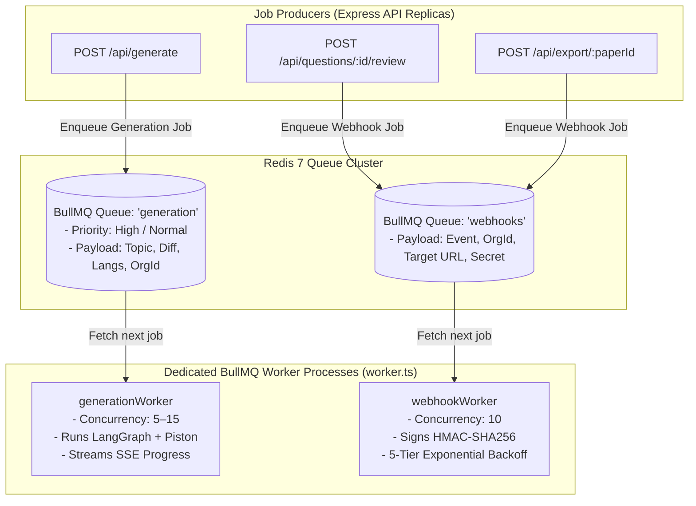
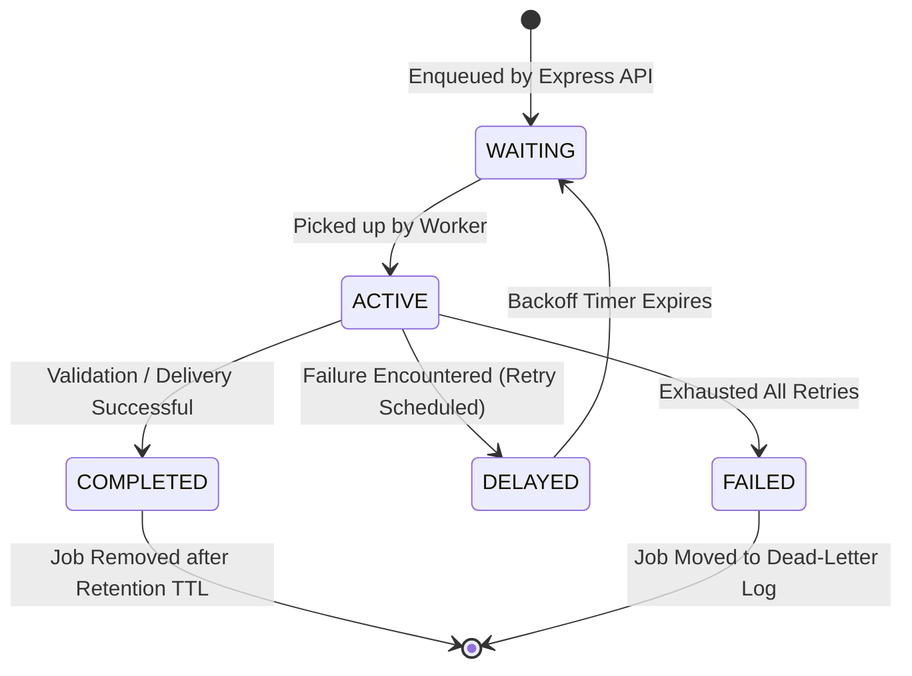
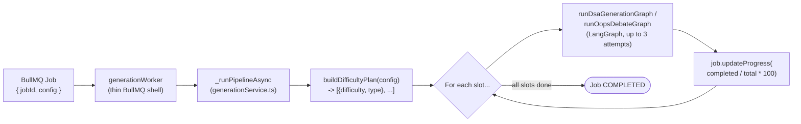

# Distributed Queue & Worker Engine

This document provides an in-depth reference for the **BullMQ and Redis 7 asynchronous job queue infrastructure** powering Question Forge.

---

## 1. Queue Architecture & Separation of Concerns

Question Forge operates **two independent BullMQ queues**, ensuring that high-latency AI generation jobs do not delay critical time-sensitive operations like customer webhook notifications:


```mermaid
flowchart TD
    subgraph Senders ["Job Producers (Express API Replicas)"]
        GenRoute["POST /api/generate"]
        ReviewRoute["POST /api/questions/:id/review"]
        ExportRoute["POST /api/export/:paperId"]
    end

    subgraph RedisQueues ["Redis 7 Queue Cluster"]
        Q_Gen[("BullMQ Queue: 'generation'\n- Priority: High / Normal\n- Payload: Topic, Diff, Langs, OrgId")]
        Q_Hook[("BullMQ Queue: 'webhooks'\n- Payload: Event, OrgId, Target URL, Secret")]
    end

    subgraph WorkerPool ["Dedicated BullMQ Worker Processes (worker.ts)"]
        W_Gen["generationWorker\n- Concurrency: 5–15\n- Runs LangGraph + Piston\n- Streams SSE Progress"]
        W_Hook["webhookWorker\n- Concurrency: 10\n- Signs HMAC-SHA256\n- 5-Tier Exponential Backoff"]
    end

    GenRoute -->|Enqueue Generation Job| Q_Gen
    ReviewRoute & ExportRoute -->|Enqueue Webhook Job| Q_Hook

    Q_Gen -->|Fetch next job| W_Gen
    Q_Hook -->|Fetch next job| W_Hook
```

---

## 2. Job Lifecycles & State Transitions

BullMQ jobs transition through strict deterministic states:


```mermaid
stateDiagram-v2
    [*] --> WAITING: Enqueued by Express API
    WAITING --> ACTIVE: Picked up by Worker
    
    ACTIVE --> COMPLETED: Validation / Delivery Successful
    
    ACTIVE --> DELAYED: Failure Encountered (Retry Scheduled)
    DELAYED --> WAITING: Backoff Timer Expires
    
    ACTIVE --> FAILED: Exhausted All Retries
    
    COMPLETED --> [*]: Job Removed after Retention TTL
    FAILED --> [*]: Job Moved to Dead-Letter Log
```

### Stalled Job Detection & Lock Renewal
When a worker picks up a job:
1. It acquires a Redis lock with a default lock duration (30,000ms).
2. The worker automatically runs an internal heartbeat to renew the lock while the job is active.
3. If the worker container crashes abruptly (e.g., host OOM or spot instance termination), the lock is abandoned.
4. When `stalledInterval` (30s) passes, another worker detects the expired lock, increments `job.stalledCounter`, and moves the job back to `WAITING`.

---

## 3. Worker Configurations & Backoff Strategies

### Generation Worker Configuration

The real worker (`apps/api/src/queues/generationWorker.ts`) is a thin BullMQ shell — it does not itself know about LangGraph, sandboxes, or debates. It just dequeues a job and hands the whole thing off to `_runPipelineAsync` (`generationService.ts`), which loops over every `(difficulty, type)` slot the request asked for and runs each through the LangGraph generate/validate graph (see [`multi-agent-debate.md`](./multi-agent-debate.md)):

```typescript
export function startGenerationWorker() {
  const concurrency = Number(process.env.WORKER_CONCURRENCY ?? 5);

  const worker = new Worker<GenerationJobData>(
    'generation',
    async (job: Job<GenerationJobData>) => {
      logger.info(`[Worker] Processing job ${job.id} (attempt ${job.attemptsMade + 1})`);
      // Progress percentage is updated inside _runPipelineAsync, once per
      // (difficulty, type) slot completed — not a fixed 10/40/75/100 schedule.
      await _runPipelineAsync(job.data.jobId, job.data.config, job);
    },
    { connection: redisConnection, concurrency }
  );

  worker.on('completed', (job) => logger.info(`[Worker] Job ${job.id} completed successfully`));
  worker.on('failed', (job, err) => logger.error(`[Worker] Job ${job?.id} failed`, { error: err.message }));
  return worker;
}
```


```mermaid
flowchart LR
    Job["BullMQ Job\n{ jobId, config }"] --> Worker["generationWorker\n(thin BullMQ shell)"]
    Worker --> Pipeline["_runPipelineAsync\n(generationService.ts)"]
    Pipeline --> Plan["buildDifficultyPlan(config)\n-> [{difficulty, type}, ...]"]
    Plan --> ForEach{"For each slot..."}
    ForEach --> Graph["runDsaGenerationGraph /\nrunOopsDebateGraph\n(LangGraph, up to 3 attempts)"]
    Graph --> Progress["job.updateProgress(\ncompleted / total * 100)"]
    Progress --> ForEach
    ForEach -- "all slots done" --> Done(["Job COMPLETED"])
```

Concretely: a request for 10 questions produces 10 slots, and progress climbs in increments of 10% as each slot's graph settles into `VALIDATED` or `FAILED` — not a fixed four-stage percentage schedule.

### Webhook Worker & Exponential Backoff
Customer ATS/LMS endpoints frequently experience transient downtime or rate limiting. Outbound webhooks employ a **5-tier exponential backoff with jitter**:

```typescript
export const webhookWorker = new Worker(
  'webhooks',
  async (job: Job) => {
    const { webhookUrl, secret, payload } = job.data;
    const signature = crypto
      .createHmac('sha256', secret)
      .update(JSON.stringify(payload))
      .digest('hex');

    const response = await fetch(webhookUrl, {
      method: 'POST',
      headers: {
        'Content-Type': 'application/json',
        'X-QuestionForge-Signature': `sha256=${signature}`,
      },
      body: JSON.stringify(payload),
      timeout: 10000,
    });

    if (!response.ok) {
      throw new Error(`HTTP ${response.status}: ${response.statusText}`);
    }
  },
  {
    connection: redisClient,
    concurrency: 10,
    settings: {
      backoffStrategy: (attemptsMade: number) => {
        // Delays: 2s, 4s, 8s, 16s, 32s + jitter
        return Math.pow(2, attemptsMade) * 1000 + Math.floor(Math.random() * 500);
      },
    },
  }
);
```

---

## 4. Real-Time Telemetry & Monitoring

Administrators inspect live queue health via the `/api/admin/queues/stats` endpoint:
```json
{
  "generation": {
    "waiting": 3,
    "active": 5,
    "completed": 1420,
    "failed": 8,
    "delayed": 0
  },
  "webhooks": {
    "waiting": 0,
    "active": 2,
    "completed": 850,
    "failed": 2,
    "delayed": 1
  }
}
```
If `generation.waiting` consistently exceeds 20, the Kubernetes or AWS ECS horizontal pod autoscaler automatically deploys additional worker replicas.
