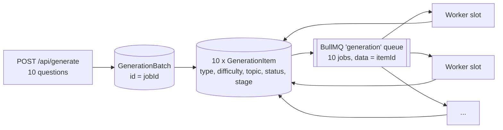
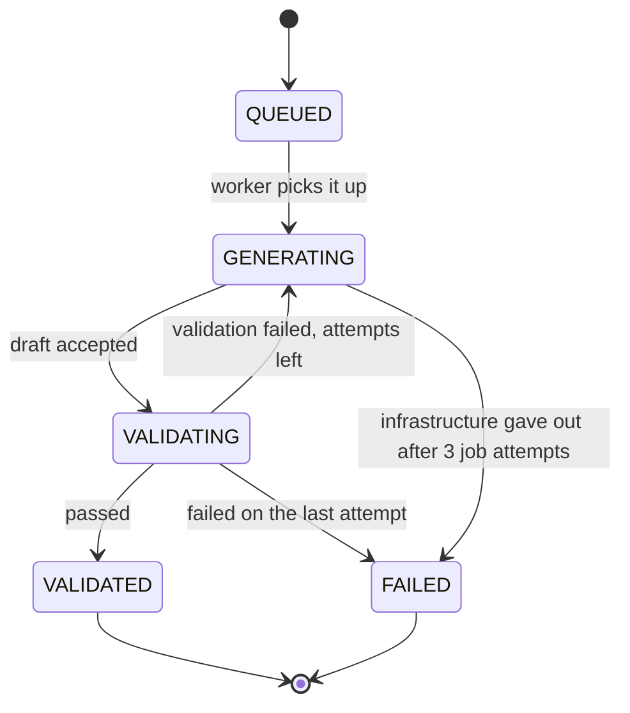

# Queue & Worker Engine

How a click on "Generate" becomes background work, how progress is reported, and what happens when something breaks.

---

## 1. One job per question

`POST /api/generate` does not start one long job. It writes a **batch** and one **item** per requested question to Postgres, then puts one BullMQ job per item on the `generation` queue.


```mermaid
flowchart LR
    Req["POST /api/generate\n10 questions"] --> B[("GenerationBatch\nid = jobId")]
    B --> I[("10 x GenerationItem\ntype, difficulty, topic, status, stage")]
    I --> Q[["BullMQ 'generation' queue\n10 jobs, data = itemId"]]
    Q --> W1["Worker slot"] & W2["Worker slot"] & W3["..."]
    W1 & W2 & W3 --> I
```

| | Before | Now |
|---|---|---|
| Unit of work | The whole batch in one job | One question per job |
| A crash or retry | Re-ran every question, leaving duplicates | Repeats only that question; the item remembers its `questionId` |
| Parallelism | Questions ran one after another | Up to `WORKER_CONCURRENCY` (default 5) at once per worker process |
| Progress | A percentage | Each question's status, current step and failure reason |

`buildGenerationPlan` decides the slots: difficulties by the requested percentages, with question types and topics rotating across the whole plan so each question is anchored to **one** topic.

The same machinery runs two other kinds of work as one-item batches (`GenerationBatch.kind`):

- `REVALIDATE` — after a reviewer edits a question's content, or `POST /api/questions/:id/revalidate`. No LLM drafting; validation only.
- `COMPLETE_IMPORT` — `POST /api/questions/:id/complete` on an imported `DRAFT`: write solutions and tests for the existing statement, then validate them.

## 2. Item lifecycle


```mermaid
stateDiagram-v2
    [*] --> QUEUED
    QUEUED --> GENERATING: worker picks it up
    GENERATING --> VALIDATING: draft accepted
    VALIDATING --> GENERATING: validation failed, attempts left
    VALIDATING --> VALIDATED: passed
    VALIDATING --> FAILED: failed on the last attempt
    GENERATING --> FAILED: infrastructure gave out after 3 job attempts
    VALIDATED --> [*]
    FAILED --> [*]
```

While an item runs, its `stage` column is updated with a plain description of the current step ("Drafting with anthropic (attempt 2 of 3)", "Sandbox: differential testing across 4 language(s)"). That text is what the UI shows.

## 3. Two kinds of failure

| | A question that will not validate | Infrastructure failure |
|---|---|---|
| Example | Solutions disagree; MCQ key is wrong | LLM provider returns 503; Piston is down |
| Handled by | The generate → validate loop (3 attempts, with feedback) | BullMQ: 3 job attempts, exponential backoff from 5 s |
| The job | **Completes normally** | **Throws**, so it is retried |
| Final state | Item `FAILED` with the validator's report | After the last attempt: item `FAILED` with "Gave up after 3 attempts: …" |

When a job runs out of attempts, the worker's `failed` handler calls `failGenerationItem`, so nothing is ever left showing "in progress" forever, and no question stays in `VALIDATING`.

## 4. Status and live progress

`GET /api/generate/status/:jobId` reads the batch and its items from Postgres, **scoped to the caller's organization** (another tenant gets 404):

```json
{
  "jobId": "…", "kind": "GENERATE",
  "state": "active", "progress": 40, "done": false, "total": 10,
  "counts": { "queued": 2, "running": 4, "validated": 3, "failed": 1 },
  "items": [
    { "index": 0, "type": "DSA", "difficulty": "MEDIUM", "topic": "Arrays",
      "status": "VALIDATING", "stage": "Sandbox: differential testing across 2 language(s)",
      "attempts": 1, "failureReason": null, "questionId": "…", "title": "…" }
  ],
  "usage": { "inputTokens": 48211, "outputTokens": 30954, "costUsd": 0.8119 }
}
```

- `progress` is items finished ÷ items total — a fact, not an estimate.
- `usage` is **measured** from every provider response (drafting and reviewing). `costUsd` uses published prices for Claude models, or `LLM_PRICE_INPUT_PER_MTOK` / `LLM_PRICE_OUTPUT_PER_MTOK` if you set them; otherwise it is `null` rather than a guess. It is priced at the generator model's rate, so it is approximate when a different provider did the reviewing.

`GET /api/generate/status/:jobId/stream` sends the same object as Server-Sent Events every 1.5 s until the batch is done. It uses the normal `Authorization` header. The frontend reads it with `fetch()` rather than `EventSource`, because `EventSource` cannot send headers and the alternative — the token in the URL — leaks it into logs and history.

## 5. Cancel, retry, history

| Endpoint | What it does |
|---|---|
| `POST /api/generate/jobs/:jobId/cancel` | Stops a running batch. Items still waiting are marked `FAILED` ("Cancelled") at once. An item that is mid-attempt is allowed to finish the LLM call or sandbox run it is already in — that is already paid for — and stops before its next drafting call. Questions that were already validated are kept. |
| `POST /api/generate/jobs/:jobId/retry-failed` | For a finished generation batch: puts only its `FAILED` items back on the queue. Each keeps its slot (type, difficulty, topic) and its question row, so the retry replaces the failed draft rather than adding another. Retried slots do not count against the daily quota a second time. |
| `GET /api/generate/jobs` | The organization's 20 most recent batches with validated / failed counts and token usage. |

The Generate page has a **Cancel** button while a job runs, a **Retry N failed** button when it finishes with failures, and a **Recent Jobs** table; choosing a job there reopens its per-question view.

## 6. Housekeeping (`services/maintenanceService.ts`)

Started with the workers (embedded or standalone); runs at start-up and every `MAINTENANCE_INTERVAL_MINUTES` (default 5).

- **Orphaned items.** An item that is not finished, has had no progress for `STALE_ITEM_MINUTES` (default 15), and has no waiting / active / delayed job in the queue is put back on the queue. This is what would otherwise be stuck forever if Redis lost its data. The worker continues from the item's saved state.
- **Expired exports.** Locally stored export files whose download link has expired are deleted.

## 7. Webhook queue

Outbound webhooks have their own queue (`webhooks`): 5 attempts, exponential backoff from 2 s, 10 s timeout per attempt, concurrency 10. A slow customer endpoint therefore cannot hold up generation. Events: `question.validated`, `question.approved`, `question.rejected`, `generation.completed`, `webhook.ping`. See the [security whitepaper](../security/security-whitepaper.md) for signing and SSRF protection.

## 8. Processes

| Mode | How | Use |
|---|---|---|
| Embedded | `npm run dev` — the API process also runs both workers (default outside production). | Development. |
| Separate | API with `ENABLE_EMBEDDED_WORKERS=false`, plus `npm run start:worker --workspace=apps/api`. | Production: validation work cannot starve HTTP, and workers scale on queue depth. |

Both processes drain on `SIGTERM`/`SIGINT`: stop taking new work, let the current jobs finish, disconnect. The API force-exits after 30 s if draining hangs. The generation worker's job lock is 120 s because a multi-language validation can legitimately take minutes.

## 9. Monitoring

- `GET /api/admin/queues/stats` — job counts per queue (admin only).
- Bull Board at `/admin/queues` — inspect and retry jobs. It is opened from **Admin → Queue Monitor → Live Bull Board UI**, which uses a one-time ticket; see the security whitepaper.

## 10. Quota and rate limits

- `GENERATE_RATE_LIMIT_PER_MIN` (default 5) generation requests per minute **per signed-in user**.
- Per-organization daily quota (`Organization.maxQuestionsPerDay`, default 200) counts question slots **requested** today in UTC, whether or not they succeeded — that is what costs money. Imports and re-validations do not count.
