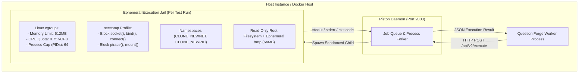
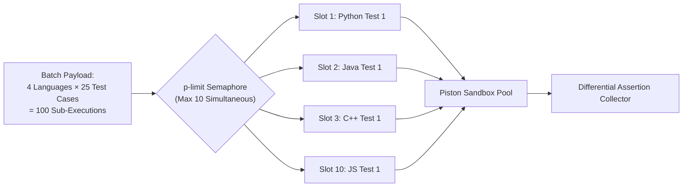

# Sandboxed Code Execution Engine

This document details the security architecture, concurrency mechanics, and differential validation protocol of the **Question Forge Sandboxed Code Execution Engine**.

---

## 1. Threat Model & Sandboxing Requirements

Executing untrusted, AI-generated code introduces critical security risks:
- **Remote Code Execution (RCE)**: Malicious or hallucinated code attempting system calls (`rm -rf /`, `fork()` bombs).
- **Network Exfiltration**: Code establishing outbound socket connections to exfiltrate database credentials or AWS IAM instance profiles.
- **Resource Exhaustion**: Infinite loops (`while (true)`) or memory bloat consuming host RAM and crashing adjacent services.

To mitigate these threats, Question Forge executes all compilation and runtime evaluation within **Piston**, a hardened, containerized code execution engine isolated from host processes.

---

## 2. Container Isolation & Security Boundaries



### Key Security Controls
1. **Network Namespace Isolation (`CLONE_NEWNET`)**: Containers operate without network interfaces (loopback disabled or firewalled). Sockets cannot be created.
2. **Resource Throttling (Linux cgroups)**:
   - **RAM Ceiling**: Hard cap at **512 MB**. Any test allocating beyond this limit is immediately terminated via an `OOMKilled` signal.
   - **CPU Time Quota**: Max **0.75 vCPU** core allocation.
   - **Wall-Clock Execution Timeout**: 3.0 seconds maximum. Any process exceeding this duration is killed with `SIGKILL`.
3. **Restricted System Calls (`seccomp`)**: High-risk system calls (`clone`, `mount`, `ptrace`, `chroot`) are forbidden.
4. **Unprivileged User Execution**: Code runs under an unprivileged `piston` UID (`1000:1000`) with no `sudo` or setuid privileges.

---

## 3. High-Concurrency Parallel Execution (`p-limit`)

### Legacy Sequential Anti-Pattern
In naive implementations, a question with 4 target languages and 25 test cases is evaluated sequentially:
$$\text{Total Calls} = 4 \times 25 = 100 \text{ synchronous executions}$$
At an average of $250\text{ms}$ per compile-and-run cycle, total validation takes:
$$100 \times 0.25\text{s} = 25.0 \text{ seconds (blocking HTTP)}$$

### Question Forge Concurrency Semaphore
Question Forge flattens all language-and-test combinations into a concurrent task pool managed by a `p-limit` semaphore (default concurrency: **10**):



**Result**: 100 executions complete in **$\sim 1.2$ to $1.8$ seconds**, representing a **$>15\times$ performance acceleration**.

---

## 4. Differential Testing Engine

Passing simple assertions is insufficient for enterprise technical recruiting. Question Forge performs **differential testing**:
1. It executes the **optimal solution** with input $X$.
2. It executes the **brute-force solution** with input $X$.
3. It performs a strict equality check:
   $$\text{Output}(\text{Optimal}, X) \equiv \text{Output}(\text{BruteForce}, X)$$

```typescript
export async function verifyDifferentialOutputs(
  optimalRun: ExecutionResult,
  bruteForceRun: ExecutionResult
): Promise<boolean> {
  if (optimalRun.exitCode !== 0 || bruteForceRun.exitCode !== 0) {
    return false;
  }
  
  const cleanOptimal = optimalRun.stdout.trim().replace(/\r\n/g, '\n');
  const cleanBrute = bruteForceRun.stdout.trim().replace(/\r\n/g, '\n');
  
  return cleanOptimal === cleanBrute;
}
```

If outputs match across all 25+ test cases, the question passes the sandbox validation phase and is routed to vector deduplication.
