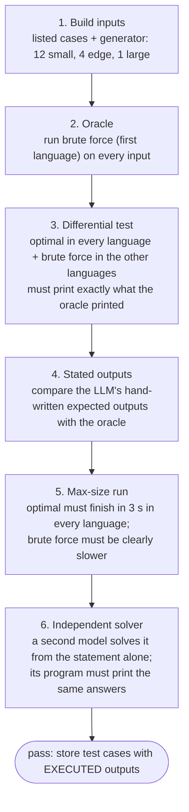

# Sandboxed Code Execution & Differential Validation

How LLM-written code is run, and how running it turns a draft coding question into a verified one.

---

## 1. Running untrusted code

Everything goes through one function, `executeSandbox` (`packages/sandbox/src/index.ts`). It takes a language, source code and stdin, and returns stdout, stderr, the exit code, whether the run timed out, and — importantly — `infraError`.

| Driver (`SANDBOX_DRIVER`) | What it is | When to use it |
|---|---|---|
| `piston` (default) | HTTP calls to a [Piston](https://github.com/engineer-man/piston) container. 3 s run limit, 10 s compile limit, 128 MB per run. | Always, outside of local development. |
| `local` | Plain child processes on the host using installed toolchains (`python3`, `node`, `g++`, `javac`, `sqlite3`). **No isolation at all.** | Development and tests without Docker. The API and worker refuse to start with it when `NODE_ENV=production`. |

Piston needs these runtimes installed: `python`, `java`, `gcc` (for `cpp`), `node` (for `javascript`) and `sqlite3` (for SQL questions).

### Isolation of the Piston container (`docker-compose.yml`)

- Its own Docker network (`qforge-sandbox`) with no route to Postgres. Set `internal: true` on that network in production so it has no outbound internet either.
- `no-new-privileges`, 512 MB memory cap, 0.75 CPU, `nofile` limit of 1024, job directory on `tmpfs`.

### An outage is not a wrong answer

If Piston is unreachable, returns a non-2xx status, or does not know the runtime, the result has `infraError: true`. The validator turns that into a `SandboxUnavailableError`, which **fails the job so the queue retries it**. It is never reported to the LLM as "your solution is wrong" — that would burn three attempts rewriting code that was fine.

A compile failure is the opposite case: it *is* the code's fault, and the compiler output is returned so the model can fix it.

A **timeout** is retried once before it counts. On a busy sandbox host a correct program can occasionally miss the 3 s limit; one extra run is much cheaper than rejecting a good draft. The exception is the brute-force run on the maximum-size input, where a timeout is the expected result.

## 2. Differential validation of a coding question

`validateCodeQuestion` in `apps/api/src/services/validationService.ts`. The draft supplies, per requested language, an **optimal** solution and a **brute-force** solution — both complete programs that read stdin and print the answer — plus hand-written test cases and an **input generator**.

```mermaid
flowchart TD
    A["1. Build inputs\nlisted cases + generator: 12 small, 4 edge, 1 large"] --> B["2. Oracle\nrun brute force (first language) on every input"]
    B --> C["3. Differential test\noptimal in every language + brute force in the other languages\nmust print exactly what the oracle printed"]
    C --> D["4. Stated outputs\ncompare the LLM's hand-written expected outputs with the oracle"]
    D --> E["5. Max-size run\noptimal must finish in 3 s in every language;\nbrute force must be clearly slower"]
    E --> F["6. Independent solver\na second model solves it from the statement alone;\nits program must print the same answers"]
    F --> OK(["pass: store test cases with EXECUTED outputs"])
```

**1. Inputs.** The generator is a Python program. Given `"<seed> <mode>"` on stdin it prints one valid input: `small` (tiny sizes, so brute force is instant and ties are common), `edge` (boundary shapes) or `large` (maximum constraints, worst case for brute force). Counts come from `VALIDATION_RANDOM_CASES` (12) and `VALIDATION_EDGE_CASES` (4). A generator that crashes or prints nothing fails the draft.

**2. Oracle.** The brute force in the first requested language is run on every non-large input. Its outputs are the source of truth. If it crashes, times out, or prints nothing, the draft fails with the offending input.

**3. Differential test.** Every other program must reproduce the oracle exactly (trailing whitespace ignored, nothing else). A disagreement fails the draft and the report names the solution, the input, and both outputs.

**4. Stated outputs.** The hand-written `expectedOutput` values are the model's mental arithmetic, so they are compared with what the code printed:

| Situation | Result |
|---|---|
| A case marked `isSample` (it appears in the statement) disagrees | **Fail** — the statement's own example would be wrong. |
| More than 25 % of stated outputs disagree | **Fail** — the solutions probably solve a different problem. |
| A few non-sample cases disagree | Corrected from execution; counted in `stats.expectedOutputCorrections`. |
| Re-validating a human edit (`trustStatedOutputs`) | **Any** disagreement fails — the reviewer's values are the intent. |

**5. Maximum-size run.** The optimal solution runs on the `large` input in every language and must finish within the 3 s limit, with all languages agreeing. The brute force runs on the same input. If it times out, or takes at least 3× as long as the optimal solution, the complexity gap is `confirmed`. For `MEDIUM` and `HARD` questions a missing gap **fails** the draft: a "hard" problem that brute force solves at maximum size is not hard. Set `VALIDATION_ENFORCE_COMPLEXITY_GAP=false` to record the result without failing. `EASY` questions are never failed on this.

**6. Independent solver** (`blindSolveCodeQuestion`). Steps 1–5 prove the two reference solutions agree with each other. They were written by the same model in the same reply, so they can agree and still both solve a slightly different problem than the statement describes. To test the *statement*, the reviewer model is given the statement and nothing else — no solutions, no test cases — and asked for a complete program in the first requested language. That program is run on up to 20 of the verified test cases.

| The independent program… | Verdict (`stats.blindSolver`) | Effect |
|---|---|---|
| prints every expected output | `agreed` | Pass. |
| runs, but prints something different | `disagreed` | **Fail.** The report shows the input and both answers, and tells the generator to make the statement pin the answer down (tie-breaks, indexing, edge cases) or fix the solutions. |
| is missing, does not compile, or crashes on most inputs | `inconclusive` | No effect. That says something about the solver, not the question. |

It costs one extra LLM call per coding question and can be switched off with `VALIDATION_BLIND_SOLVER=false`. It does not run when a human edit is re-validated (re-validating code makes no LLM call at all).

The stored `validationResult.stats` holds the numbers: listed cases, generated cases, sandbox runs, corrections, the measured timings, and the independent solver's verdict.

### Why this replaced the old checks

The previous validator appended fixed "edge cases" such as `[]` with an empty expected output and compared the program's stdout with that empty string, so most array/string/tree questions could not pass. It also asked the model for bare functions (`def solution(...)`) while feeding stdin and reading stdout, so nothing was ever printed. Both are gone: inputs now come from the question's own generator, and solutions are full programs.

## 3. SQL questions

`validateSqlQuestion`. The draft supplies `ddl`, at least two `datasets` (INSERT scripts), a `referenceQuery`, and an `alternativeQuery` that solves the same problem a different way.

For each dataset a fresh SQLite database gets the DDL and that dataset, and both queries run. They must both succeed and return the same rows (as an unordered set unless the draft says `orderMatters`). The example dataset must produce at least one row. The stored test cases are the datasets with the executed result.

Scripts containing sqlite3 dot-commands (`.shell`, `.read`, …), `ATTACH DATABASE`, `load_extension`, `readfile` or `writefile` are rejected before anything runs.

## 4. Code shown in OOPS and conceptual questions

OOPS and conceptual MCQs that show a code snippet and ask what it prints are also proven by execution (`verifySnippet`, `sandbox_snippet`). The draft must carry a `verification` object — `{ language, program, expectedOutput }`, where `program` is the exact snippet plus whatever scaffolding it needs. It is stored in `validationAssets.verification` and run through the same sandbox as everything else, before any review call:

| Check | Fails when |
|---|---|
| The program runs | It does not compile, crashes, or exceeds the time limit. |
| Claimed output | The program's real stdout differs from the `expectedOutput` the draft claimed. |
| Answer key | The real output is not exactly the text of the option marked correct. |
| Uniqueness | Another option has the same text as the real output (two correct answers). |
| Missing program | The statement shows code and asks for output, but no `verification` was supplied (`needsSnippetVerification`). |

A sandbox outage throws `SandboxUnavailableError` and retries the job, as for coding questions. A passing snippet is followed by the usual blind solve and adversarial review; a failing one is rejected without spending review calls, and the report is fed back to the generator. Questions that show no code, or ask for a compile error or exception, are not covered and stay `llm_review`.

Known limit: if a reviewer edits the code inside a verified question, the stored program is not updated, so re-validation compares the old program's output with the edited question and rejects it.

## 5. Concurrency and cost

All sandbox calls of one validation share a `p-limit` pool (`SANDBOX_CONCURRENCY`, default 10). A 4-language question with ~35 inputs makes roughly 290 sandbox calls, so validation takes far longer than one LLM call and Piston capacity — not the LLM — is usually what limits throughput. Size the sandbox accordingly.

## 6. Limits

- The 3 s limit and the speed comparison are wall-clock and include Piston's per-call overhead, so the complexity check is coarse. It reliably separates O(n) from O(n²) at n = 10⁵; it will not separate O(n) from O(n log n).
- The Piston driver is covered by tests with a mocked HTTP layer. All real-execution tests use the `local` driver. Run one generation against your Piston instance before relying on it.
