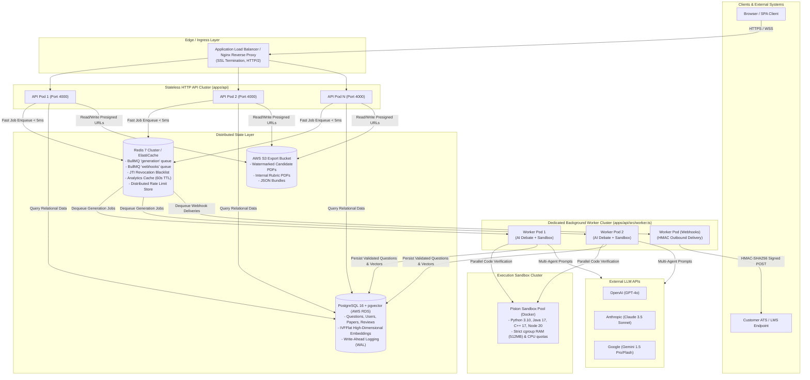
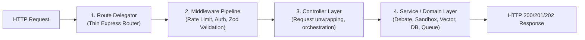

# System Architecture Overview

This document provides a comprehensive technical overview of the **Question Forge** distributed architecture, design principles, decoupling boundaries, and reliability guarantees.

---

## 1. High-Level Architectural Principles

Question Forge is designed around four foundational tenets:

1. **Decoupled Asynchronous Compute**: Time-intensive operations (multi-agent LLM deliberation, multi-language sandbox compilation, PDF watermarking) are strictly isolated from client HTTP request-response cycles.
2. **Crash Resilience & State Isolation**: Neither HTTP servers nor background workers maintain in-memory state across requests or jobs. Distributed state resides entirely in **Redis 7** (job queues, token blacklists, cache) and **PostgreSQL 16** (persistent relational data and vector embeddings).
3. **Layered Monorepo Architecture**: Clean boundaries between HTTP routing, business logic orchestration, database access, and shared schemas prevent code drift while enabling atomic builds across packages via **Turborepo**.
4. **Zero-Trust Multi-Tenancy**: Organization boundaries are cryptographically and programmatically enforced across every query, webhook delivery, and export artifact.

---

## 2. Distributed Process Topology

In production environments, Question Forge operates as two distinct, independently scalable compute workloads alongside shared infrastructure services:



---

## 3. Decoupling: API Cluster vs. Worker Cluster

### The Monolith Event Loop Bottleneck (Why Decoupling Matters)
In Node.js, the runtime operates on a single-threaded event loop. If long-running tasks—such as parsing multi-megabyte JSON payloads, computing cosine similarity over dense arrays, running synchronous AST analysis, or waiting on 30-second multi-turn LLM streams—run within the same process handling incoming HTTP requests:
1. **Event Loop Starvation**: Incoming HTTP connections wait hundreds of milliseconds just to execute the first tick, spiking API latency ($p99 > 2000\text{ms}$).
2. **Health Check Death Spirals**: Application Load Balancers issue periodic `GET /health` probes. If the single thread is blocked by an LLM synthesis loop, the health check times out. The ALB marks the instance unhealthy and kills the container mid-execution.
3. **Asymmetrical Resource Needs**: HTTP ingestion is network I/O-bound (low CPU, low RAM), whereas AI orchestration and sandbox code verification are CPU- and memory-bound.

### The Question Forge Decoupled Model

| Dimension | API Cluster (`apps/api/src/index.ts`) | Worker Cluster (`apps/api/src/worker.ts`) |
|---|---|---|
| **Process Role** | Stateless HTTP request/response & SSE stream server | Headless background queue processor |
| **Port / Ingress** | Exposes port `4000` to reverse proxy / ALB | Headless (no open HTTP ports) |
| **Scaling Metric** | ALB request latency and pod CPU utilization | BullMQ queue backlog (`waiting` + `delayed` jobs) |
| **Graceful Shutdown** | Closes HTTP listener; waits 5s for active connections | Pauses queues; awaits current job completion; disconnects Redis |
| **Embedded Mode** | Enabled in dev (`ENABLE_EMBEDDED_WORKERS=true`) | Dedicated process in prod (`ENABLE_EMBEDDED_WORKERS=false`) |

---

## 4. Layered Controller Architecture

To eliminate architectural rot where business logic, SQL queries, and HTTP validation get jumbled inside route handlers, Question Forge enforces a **4-layer architectural hierarchy**:



### Responsibility Breakdown
1. **Route Layer (`apps/api/src/routes/`)**:
   Pure routing definitions. Contains zero business logic, zero raw SQL queries, and zero direct queue interactions. Example:
   ```typescript
   router.post('/register', authController.register);
   router.post('/login', authController.login);
   router.post('/logout', authenticate, authController.logout);
   ```
2. **Middleware Layer (`apps/api/src/middleware/`)**:
   Enforces cross-cutting concerns:
   - `rateLimiter.ts`: Distributed Redis-backed sliding-window rate limiters.
   - `auth.ts`: Verifies JWT signatures and checks the token's UUID `jti` against the Redis Revocation Blacklist.
   - `errorHandler.ts`: Catches unhandled exceptions, sanitizes stack traces, and returns standardized RFC 7807 problem payloads.
3. **Controller Layer (`apps/api/src/controllers/`)**:
   Parses `req.body`, `req.params`, and `req.query`, invokes domain services or Prisma client queries, and formats standard HTTP responses (`200 OK`, `202 Accepted`, `400 Bad Request`).
4. **Service Layer (`apps/api/src/services/`)**:
   Domain business logic: LangGraph agentic debate loops, Piston sandbox invocation, vector cosine deduplication, and S3 PDF generation.

---

## 5. Resilience & Fault Tolerance Patterns

### 1. Redis BullMQ Crash Recovery
All asynchronous jobs are serialized as JSON payloads in Redis. Each job has an associated BullMQ lock. If a worker container crashes or is abruptly terminated by AWS ECS/K8s spot eviction:
- BullMQ's lock expires after `stalledInterval` (default 30 seconds).
- A surviving worker identifies the stalled job, moves it back to `waiting`, and resumes execution from step 1.
- Redis operates with **Append-Only File (AOF) persistence** (`appendfsync everysec`), ensuring zero job loss even in the event of an abrupt Redis host restart.

### 2. Provider Failover & Socket Reuse
All AI model integrations (`openai`, `anthropic`, `google-genai`) are initialized as module singletons with persistent HTTP Keep-Alive connection pools. This eliminates SSL handshake overhead ($150\text{ms}$ savings per invocation).

### 3. Graceful Draining (`SIGTERM` / `SIGINT`)
Upon receiving termination signals from Docker/Kubernetes:
```typescript
const gracefulShutdown = async (signal: string) => {
  logger.info(`Received ${signal}. Draining BullMQ workers...`);
  await Promise.all([
    generationWorker.close(),
    webhookWorker.close(),
  ]);
  await redisConnection.quit();
  process.exit(0);
};
```
Active jobs are permitted up to 30 seconds to finish execution and persist results before the process terminates.
