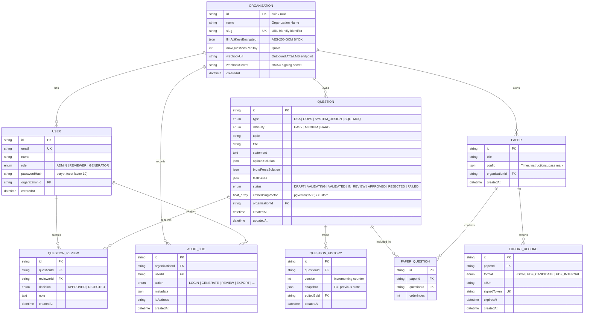

# Database Schema, ERD & Indexing Strategy

This document details the PostgreSQL 16 relational data model, Prisma ORM mappings, composite indexing strategies, and migration safety guidelines for Question Forge.

---

## 1. Entity-Relationship Model (ERD)



---

## 2. Composite Indexing Strategies

In multi-tenant systems, executing queries without composite tenant indexes results in full table scans across all organizations. Question Forge implements high-selectivity composite indexes:

### 1. `@@index([organizationId, status])` on `Question`
- **Use Case**: Filtering candidate review pools (`GET /api/questions?status=IN_REVIEW`).
- **Optimization**: Postgres performs an Index Scan on `organizationId` and immediately evaluates `status` in the index leaf without loading table rows.

### 2. `@@index([organizationId, type, difficulty])` on `Question`
- **Use Case**: Filtered search during assessment paper assembly (e.g., selecting 2 "HARD" "DSA" questions).
- **Optimization**: Satisfies compound equality predicates in a single B-Tree traversal.

### 3. `@@index([questionId, version])` on `QuestionHistory`
- **Use Case**: Fetching versioned revision history snapshots for human audit logs.
- **Optimization**: Guarantees $O(\log N)$ lookup by question ID and sequential version scanning.

---

## 3. Safe Schema Migration Protocol

To guarantee zero downtime in CI/CD pipelines, Question Forge follows backward-compatible schema changes:

1. **Step 1 (Expand)**: Add new columns as nullable (`Optional` in Prisma) or with sensible defaults.
2. **Step 2 (Deploy Code)**: Deploy API and worker containers reading from either old or new format.
3. **Step 3 (Backfill)**: Run non-blocking background script to populate existing rows.
4. **Step 4 (Contract)**: Apply migration adding `NOT NULL` constraint and drop deprecated columns.

Migrations are deployed in GitHub Actions using:
```bash
npx prisma migrate deploy
```
This applies pending migrations without attempting to generate or prompt interactively, preventing CI pipeline stalls.
