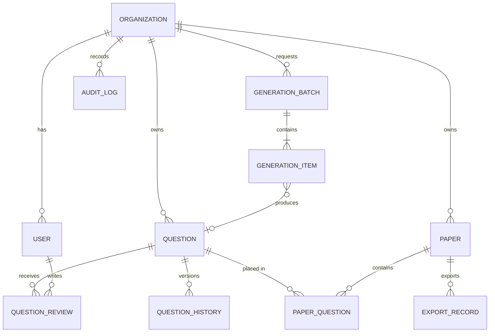

# Database Schema & Migrations

PostgreSQL 16 through Prisma. The schema is `packages/shared/prisma/schema.prisma`; this page explains the parts that are not obvious from reading it.

---

## 1. Model map


```mermaid
erDiagram
    ORGANIZATION ||--o{ USER : has
    ORGANIZATION ||--o{ QUESTION : owns
    ORGANIZATION ||--o{ PAPER : owns
    ORGANIZATION ||--o{ GENERATION_BATCH : requests
    ORGANIZATION ||--o{ AUDIT_LOG : records
    GENERATION_BATCH ||--|{ GENERATION_ITEM : contains
    GENERATION_ITEM }o--o| QUESTION : produces
    QUESTION ||--o{ QUESTION_HISTORY : versions
    QUESTION ||--o{ QUESTION_REVIEW : receives
    QUESTION ||--o{ PAPER_QUESTION : "placed in"
    PAPER ||--o{ PAPER_QUESTION : contains
    PAPER ||--o{ EXPORT_RECORD : exports
    USER ||--o{ QUESTION_REVIEW : writes
```

## 2. Notable columns

### `Organization`
| Column | Meaning |
|---|---|
| `maxQuestionsPerDay` | Daily quota of requested question slots (default 200). |
| `webhookSecret` | AES-256-GCM ciphertext (`enc:v1:…`). |
| `llmApiKeysEncrypted` | JSON map `provider → ciphertext` of the organization's own LLM keys. |

### `User`
| Column | Meaning |
|---|---|
| `isActive` | `false` = deactivated: cannot log in, and tokens already issued are rejected. |

### `Question`
| Column | Meaning |
|---|---|
| `type` | `DSA`, `OOPS`, `SYSTEM_DESIGN`, `SQL`, `CONCEPTUAL`, `MCQ`. |
| `status` | `DRAFT` (imported, not validated) → `VALIDATING` → `VALIDATED` → `APPROVED` / `REJECTED`, or `FAILED`. |
| `optimalSolution`, `bruteForceSolution` | JSON. For DSA: `{ "<language>": "<complete program>" }`. For SQL: `{ "sql": "<query>" }`. |
| `testCases` | JSON array of `{ input, expectedOutput, label, isSample?, isEdgeCase? }`. After validation the outputs are the **executed** ones, and generated cases are included. |
| `validationAssets` | What validation needs to run again: `{ inputGenerator }` for DSA, `{ sqlDdl, sqlDatasets, orderMatters }` for SQL, `{ requirements, rubric }` for system design, `{ verification: { language, program, expectedOutput } }` for OOPS/conceptual questions that show code. |
| `validationResult` | The last validation report: `method`, `passed`, `stages`, `stats`, `details`. |
| `embeddingVector` | 256 floats used for lexical duplicate detection. Empty for `FAILED` and never-validated rows. See [vector-deduplication.md](./vector-deduplication.md). |
| `retryCount` | How many times the draft was rewritten after a failed validation. |
| `version` | Incremented on every edit; the previous state goes to `QuestionHistory`. |

### `GenerationBatch` and `GenerationItem`
A batch is one request; its `id` is the public `jobId`. An item is one question slot and one BullMQ job.

| Column | Meaning |
|---|---|
| `GenerationBatch.kind` | `GENERATE`, `COMPLETE_IMPORT` or `REVALIDATE`. |
| `GenerationBatch.inputTokens` / `outputTokens` | Measured LLM usage for the whole batch. |
| `GenerationBatch.cancelledAt` | Set when a user cancels. Cleared if the failed items are retried. |
| `GenerationItem.status` | `QUEUED`, `GENERATING`, `VALIDATING`, `VALIDATED`, `FAILED`. |
| `GenerationItem.stage` | Plain-language current step, shown live in the UI. |
| `GenerationItem.failureReason` | The validator's report, or the infrastructure error. |
| `GenerationItem.questionId` | Set as soon as a row exists, so a retried job updates it instead of creating another. |
| `GenerationItem.updatedAt` | Last progress. The maintenance sweeper uses it to find items that have gone quiet. |

### `ExportRecord`
`signedToken` + `storageKey` + `expiresAt` back the local-disk download links (used when S3 is not configured).

## 3. Indexes

| Index | Serves |
|---|---|
| `Question(organizationId, status)` | Review queue, status filters. |
| `Question(organizationId, type, difficulty)` | Filtered search when assembling a paper. |
| `Question(organizationId, createdAt)` | Newest-first listing and the duplicate-check scan. |
| `AuditLog(organizationId, createdAt)`, `AuditLog(organizationId, action)` | Audit log paging and filtering. |
| `GenerationBatch(organizationId, createdAt)` | Recent jobs list. |
| `GenerationItem(batchId, index)` unique, `GenerationItem(questionId)` | Status reads; "is this draft already being completed?". |

## 4. Migrations

```
packages/shared/prisma/migrations/
  20260922175739_init
  20261006000000_reconcile_schema_drift
  20261007000000_generation_batches
  20261008000000_accounts_and_job_controls
```

### The drift that was fixed

The schema had moved ahead of the `init` migration. A database built with `prisma migrate deploy` (which is what CI and the README do) was missing things the code relies on:

- `MCQ` was not in the `QuestionType` enum → requesting an MCQ failed at insert.
- `optimalSolution` and `bruteForceSolution` were `TEXT`, not `JSONB`.
- None of the composite indexes existed.

`20261006000000_reconcile_schema_drift` fixes all three. Every statement in it is a no-op when there is nothing to fix, so it is safe on a database that already matches the schema. Existing text in the two solution columns is kept, wrapped as a JSON string.

`prisma migrate diff` from the migrations to the schema is now empty.

### Applying them

| Your database was created with… | Do this |
|---|---|
| `prisma migrate deploy` / `migrate dev` (has a `_prisma_migrations` table) | `npm run db:migrate:deploy` |
| `prisma db push` (no `_prisma_migrations` table) | `npm run db:push --workspace=packages/shared` to sync it. To switch to migrations afterwards, mark all four as applied with `npx prisma migrate resolve --applied <name>`. |

**Back up first.** The `generation_batches` and `accounts_and_job_controls` migrations only add tables, columns and enum values. The reconcile migration changes two column types.

### Changing the schema from here

1. Edit `schema.prisma`.
2. `npm run db:migrate` (creates and applies a migration locally).
3. Commit the migration with the code that needs it. CI applies migrations to a fresh database and runs the end-to-end suite against it, so drift like the above now fails the build.

For a change that old and new code cannot both live with (dropping or renaming a column), use expand → deploy → backfill → contract across separate releases.
