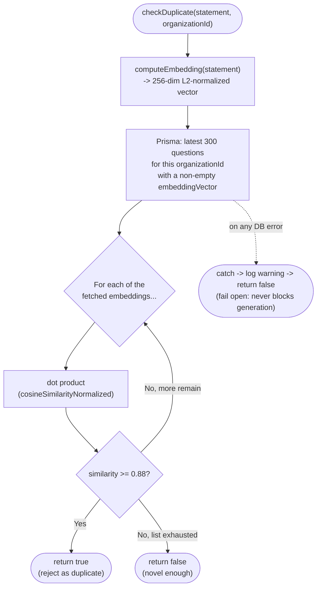
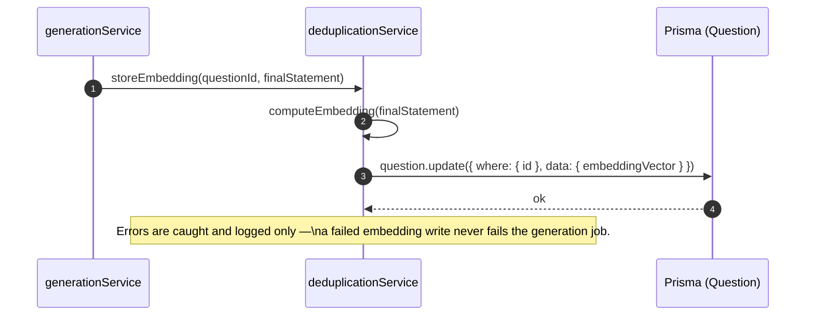

# Feature-Hashed Vector Deduplication

This document specifies the deduplication engine in Question Forge as it is actually implemented today in `apps/api/src/services/deduplicationService.ts`: deterministic feature hashing plus an in-application cosine similarity comparison. It also documents the native `pgvector` migration this is designed to make straightforward, which has **not** been made yet — see the [Roadmap](../../README.md#roadmap--future-extensions).

---

## 1. Problem Statement: Accidental Question Duplication

When scaling question generation across thousands of assessments, large language models gravitate toward canonical problem patterns (e.g., standard "Two Sum" variations, typical DFS graph traversals, basic LRU cache setups).

Without algorithmic deduplication:
- Candidate assessments contain repetitive problems.
- Questions leak across hiring seasons.
- Question banks become bloated with syntactic variations of identical underlying algorithmic concepts.

Question Forge prevents this by computing a **deterministic vector representation** of every candidate statement and comparing it against an organization's recent question history before persisting it.

---

## 2. Mathematical Foundation: Cosine Similarity

Given two question vectors $\mathbf{u}$ and $\mathbf{v}$, the semantic similarity is defined as the cosine of the angle between them:

$$\text{Cosine Similarity}(\mathbf{u}, \mathbf{v}) = \frac{\mathbf{u} \cdot \mathbf{v}}{\|\mathbf{u}\|_2 \|\mathbf{v}\|_2} = \frac{\sum_{i=1}^d u_i v_i}{\sqrt{\sum_{i=1}^d u_i^2} \sqrt{\sum_{i=1}^d v_i^2}}$$

### Boundary Properties
- $\mathbf{u} \equiv \mathbf{v} \implies \text{Similarity} = 1.0$ (Identical problem formulation).
- $\mathbf{u} \perp \mathbf{v} \implies \text{Similarity} = 0.0$ (Orthogonal, independent topics).
- Since every vector produced by this hasher is non-negative (term-frequency weighted bucket counts), similarity here is bounded to $[0, 1]$ in practice, not the full $[-1, 1]$ range cosine similarity allows in general.

### Decision Threshold
The implemented acceptance threshold (`DUPLICATE_THRESHOLD` in `deduplicationService.ts`) is:
$$\text{Threshold} = 0.88$$

| Similarity Range | Classification | System Action |
|---|---|---|
| $[0.88, 1.00]$ | **Duplicate / Near-Duplicate** | Reject the draft; the LangGraph `generate` node retries with this rejection as feedback (see [`multi-agent-debate.md`](../architecture/multi-agent-debate.md)). |
| $[0.00, 0.88)$ | **Distinct enough** | Permitted through to sandbox/debate validation. |

---

## 3. Feature Hashing (`computeEmbedding`)

No embedding API call, no network dependency, no GPU model — deduplication has to work the moment the API boots with zero external configuration. Question Forge uses a deterministic **256-dimensional FNV-1a feature hashing vectorizer**, implemented exactly as follows (`apps/api/src/services/deduplicationService.ts`):

```typescript
export function computeEmbedding(text: string): number[] {
  const tokens = text
    .toLowerCase()
    .split(/[^a-z0-9_]+/)
    .filter((w) => w.length > 1 && !STOPWORDS.has(w));

  const vector = new Array<number>(VECTOR_DIMENSION).fill(0); // VECTOR_DIMENSION = 256
  if (tokens.length === 0) return vector;

  const counts = new Map<string, number>();
  for (const token of tokens) {
    counts.set(token, (counts.get(token) ?? 0) + 1);
  }

  for (const [token, count] of counts.entries()) {
    // 32-bit FNV-1a hash
    let hash = 2166136261;
    for (let i = 0; i < token.length; i++) {
      hash ^= token.charCodeAt(i);
      hash = Math.imul(hash, 16777619);
    }
    const bucket = Math.abs(hash) % VECTOR_DIMENSION;
    const weight = 1 + Math.log(count); // sublinear term-frequency weighting
    vector[bucket] += weight;
  }

  // L2-normalization
  const magnitude = Math.sqrt(vector.reduce((sum, v) => sum + v * v, 0));
  if (magnitude === 0) return vector;
  return vector.map((v) => Number((v / magnitude).toFixed(6)));
}
```

Because vectors are $L_2$-normalized on creation, $\|\mathbf{u}\|_2 \|\mathbf{v}\|_2 \equiv 1.0$, so the cosine similarity calculation reduces to a plain **dot product**:
$$\text{Similarity}(\mathbf{u}, \mathbf{v}) = \sum_{i=1}^{256} u_i v_i$$

This is exactly what `cosineSimilarityNormalized()` computes, clamped to `[0, 1]` as a defensive measure against floating-point drift.

---

## 4. How Comparison Actually Runs Today (Application-Level, Not a DB Index)

`checkDuplicate(statement, organizationId)`:

1. Computes the candidate's embedding via `computeEmbedding`.
2. Fetches the organization's **300 most recently created** questions that already have a stored embedding (`prisma.question.findMany({ where: { organizationId, NOT: { embeddingVector: { isEmpty: true } } }, take: 300, orderBy: { createdAt: 'desc' } })`).
3. Loops over those 300 in Node and computes the dot product against each.
4. Returns `true` (duplicate) on the first match `>= 0.88`.



The fail-open path matters as much as the happy path: deduplication is a **quality gate**, not a correctness dependency — a transient Postgres blip should never be the reason a generation job stalls.

### Writing an embedding back (`storeEmbedding`)

Only reached after a question has actually passed validation, so the bank only ever accumulates embeddings for real, kept questions:



The `embeddingVector` column is a plain Prisma `Float[]` (a native Postgres array), **not** a `pgvector` `vector` column, and there is no `ivfflat`/HNSW index or `<=>` distance-operator query anywhere in the codebase today. `checkDuplicate` fails open (returns `false`, logs a warning) on any error, so a transient DB issue never blocks generation — deduplication is a quality gate, not a correctness dependency.

This is a deliberate, correct-for-current-scale design: bounding the comparison to the 300 most recent questions keeps it O(300) per candidate regardless of how large the org's total question bank grows, at the cost of only catching duplicates against *recent* history rather than the entire bank.

---

## 5. Roadmap: Migrating to Native `pgvector`

The Docker/RDS Postgres image (`pgvector/pgvector:pg16`) already ships with the extension available specifically so this migration is a schema change, not an infrastructure change, when the 300-row window above stops being sufficient:

```sql
-- Enable the extension (already available in the shipped image, not yet used)
CREATE EXTENSION IF NOT EXISTS vector;

-- A real vector column + approximate nearest-neighbor index
ALTER TABLE "Question" ADD COLUMN embedding vector(256);
CREATE INDEX idx_questions_embedding_ivfflat
ON "Question"
USING ivfflat (embedding vector_cosine_ops)
WITH (lists = 100);
```

```sql
-- Tenant-isolated nearest-neighbor query, once the column above exists
SELECT id, title, (1 - (embedding <=> $targetVector::vector)) AS similarity
FROM "Question"
WHERE "organizationId" = $currentOrgId
ORDER BY embedding <=> $targetVector::vector ASC
LIMIT 1;
```

Prisma doesn't have first-class support for the `vector` type, so this would be modeled as `Unsupported("vector(256)")` and read/written via `$queryRaw`/`$executeRaw`, replacing `checkDuplicate`'s in-application loop with a single indexed query — the point at which "1,000,000+ questions in under 15ms" becomes a real, measured claim rather than an aspirational one.
