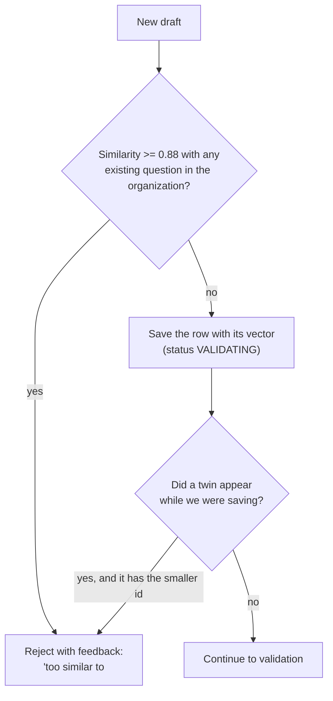

# Duplicate Detection

How Question Forge avoids generating the same question twice, and what this check can and cannot catch.

---

## 1. What it is

A **lexical** similarity check: two statements count as duplicates when they share most of their vocabulary. It runs entirely in application code — no embedding API, no network call, no database extension.

It is **not** semantic. It catches a reworded copy of a statement. It does not catch the same underlying problem told as a different story ("maximum subarray sum" vs. "best stretch of days for a hiker"). The UI and API call the stored value an "embedding" for historical reasons; it is a hashed bag of words.

## 2. The vector (`computeEmbedding`)

`apps/api/src/services/deduplicationService.ts`

1. Lower-case the statement and split on anything that is not a letter, digit or underscore.
2. Drop one-character tokens and stopwords (common English words plus prompt boilerplate such as *given*, *return*, *input*, *output*, *constraints*).
3. Hash each remaining token with 32-bit FNV-1a into one of **256** buckets.
4. Add `1 + ln(count)` to that bucket (so a word repeated 20 times does not dominate).
5. L2-normalise.

Because the vectors are normalised, the cosine similarity of two statements is just their dot product:

$$\text{sim}(a, b) = \sum_{i=1}^{256} a_i \, b_i$$

A similarity of **0.88 or higher** is treated as a duplicate. With only 256 buckets, unrelated words can collide, which nudges every similarity upward slightly; the threshold was chosen with that in mind.

## 3. When it runs (`findDuplicate`)

During `validate`, before any sandbox or review work:

- Compared against the organization's most recent `DEDUP_SCAN_WINDOW` questions (default 5000) of **every status except `FAILED`** — including questions that are still being validated.
- **Twin check.** Questions in a batch are generated in parallel, so two jobs can both pass the first check before either has saved. Right after saving, each job looks again; of two twins, the one with the larger id yields and is told to write something different. Exactly one survives.
- A question that ends `FAILED` has its vector cleared, so a broken draft never blocks later ones.
- If the check itself errors (e.g. the database is briefly unavailable) it **fails open**: generation continues without it.

The generator is also told up front which titles already exist for that question type (up to 40), which prevents most duplicates before this check is ever needed.

## 4. Cost

One query that loads up to 5000 × 256 floats, and 5000 dot products — a few milliseconds of CPU. This is fine for banks of thousands of questions per organization. It will not scale to hundreds of thousands.

## 5. Not built: semantic search with `pgvector`

Postgres runs on the `pgvector/pgvector:pg16` image, but **no `vector` column or index is used**. `Question.embeddingVector` is a plain `Float[]`.

Catching "same problem, different wording" needs real embeddings from a model plus a `vector` column with an HNSW index. That is a schema change, an embedding-provider dependency (Anthropic offers no embedding endpoint, so it would have to be OpenAI, Gemini or a local model), and a backfill. It was deliberately left out of this round because it could not be built and verified without a live database of real questions to tune the threshold against.
