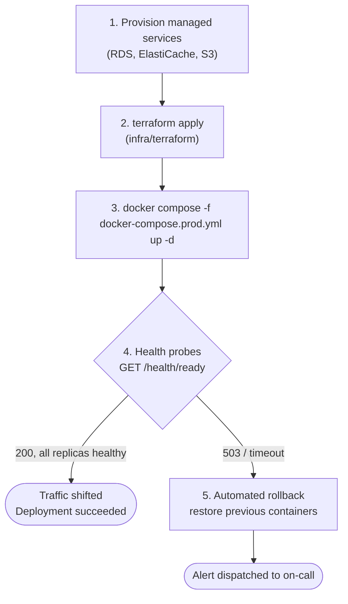
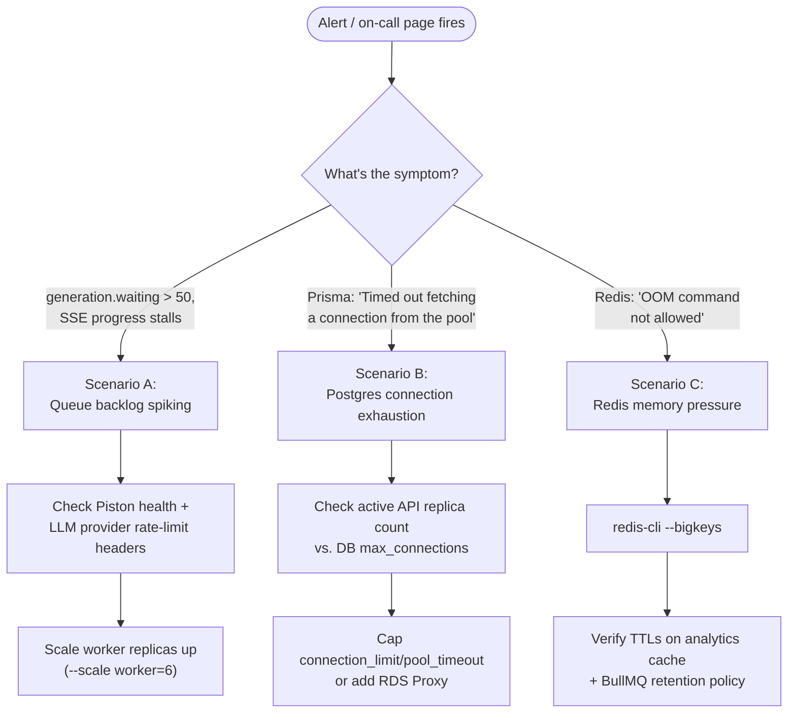

# Production Deployment & SRE Runbook

This runbook guides Site Reliability Engineers (SRE) and DevOps practitioners through provisioning, deploying, monitoring, and operating Question Forge in high-availability enterprise cloud environments.



This is the same shape as the CI/CD diagram in the root `README.md` (`## Core Workflows & Diagrams`), narrowed to what an operator actually runs by hand versus what CI automates end to end.

---

## 0. Required Configuration

With `NODE_ENV=production` the API and the worker **exit at boot** unless all of these hold (`apps/api/src/utils/config.ts`):

| Setting | Requirement |
|---|---|
| `JWT_SECRET` | 32+ random characters, not an example value. `openssl rand -hex 32` |
| `ENCRYPTION_KEY` | 64 hex characters, not all zeros. `openssl rand -hex 32`. Encrypts webhook secrets and per-organization LLM keys; if you change it, stored secrets must be re-entered. |
| `ALLOW_MOCK_AUTH` | Must not be `true`. |
| `SANDBOX_DRIVER` | Must not be `local`. |

Also needed:

- **An LLM key** — a server-wide `ANTHROPIC_API_KEY` / `OPENAI_API_KEY` / `GOOGLE_GEMINI_API_KEY`, or per-organization keys under Admin → LLM Keys. Configure two providers if you can, so MCQ and system-design questions are reviewed by a different model than the one that wrote them (or pin the reviewer with `REVIEW_PROVIDER`). The `openai` provider also works with any OpenAI-compatible API such as Groq: set `OPENAI_API_KEY`, `OPENAI_BASE_URL` and `OPENAI_MODEL`. Free tiers have tight per-minute limits, so lower `WORKER_CONCURRENCY` and request fewer languages per coding question.
- **Piston runtimes** — `python`, `java`, `gcc`, `node`, and `sqlite3` (for SQL questions).
- **Export storage** — S3 credentials. With more than one API replica S3 is required, because replicas do not share a disk. On a single machine you may set `EXPORT_STORAGE=local` instead.
- **Redis** with `maxmemory-policy noeviction`.
- **A reverse proxy that does not buffer** `/api/generate/status/*/stream` (Server-Sent Events) and forwards `/admin/queues` to the API. `apps/frontend/nginx.conf` does both.

### Database migrations

Run before starting new code:

```bash
npm run db:migrate:deploy
```

If your database was created with `prisma db push` rather than migrations, or if this is the first deploy since the schema-drift fix, read [Schema & Migrations → Applying them](../database/schema-and-indexing.md#applying-them) first. **Take a backup** before applying to a database with data in it.

### First admin

There is no public sign-up. `npm run db:seed` creates the `demo` organization with `admin@demo.com` / `password123`. **Sign in and change that password** (sidebar → Change Password) before exposing the service, and reset or deactivate `reviewer@demo.com` under Admin → Team Members. Further users are added there too.

To create additional organizations through the API, list the operator's email in `SUPERADMIN_EMAILS`.

---

## 1. Production Architecture Checklist

Before launching production workloads, verify that external managed services satisfy these baseline specifications:

| Service | Recommended Managed Service | Minimum Production Sizing |
|---|---|---|
| **Database** | AWS RDS PostgreSQL 16 | `db.r6g.xlarge` (32 GB RAM, 4 vCPUs, Multi-AZ enabled) |
| **Vector Extension** | PostgreSQL `pgvector`-enabled image (`pgvector/pgvector:pg16`, or RDS with the extension allow-listed) | Available for a future native ANN index; today's deduplication runs in application code — see [`vector-deduplication.md`](../database/vector-deduplication.md) |
| **Cache & Queues**| AWS ElastiCache for Redis 7 | `cache.r6g.large` (Multi-AZ with auto-failover, AOF enabled) |
| **Export Storage** | AWS S3 Bucket | Private bucket with server-side encryption (SSE-S3 or SSE-KMS) |
| **Sandbox Cluster**| Auto-Scaling Group (EC2 / Docker) | 2× `c6i.xlarge` running Piston Docker containers |
| **Compute Cluster**| AWS ECS Fargate or EKS | 4× Stateless API Pods + 2–8 Headless Worker Pods |

---

## 2. Infrastructure as Code (Terraform)

Question Forge includes automated Terraform configurations under `infra/terraform/`:

```bash
cd infra/terraform

# 1. Initialize provider plugins and remote state
terraform init

# 2. Plan resource changes
terraform plan -out=tfplan.binary

# 3. Apply infrastructure provisioning
terraform apply tfplan.binary
```

### Outputs Produced:
- `alb_dns_name`: Public DNS endpoint for the Application Load Balancer.
- `rds_endpoint`: Private PostgreSQL endpoint.
- `elasticache_endpoint`: Private Redis cluster configuration endpoint.
- `s3_bucket_arn`: Export storage bucket identifier.

---

## 3. Decoupled Production Deployment (Docker Compose)

For container-native environments, use `docker-compose.prod.yml`:

```bash
# Pull latest images and launch decoupled services
docker compose -f docker-compose.prod.yml up -d
```

### Service Verification
```bash
# Check running status of decoupled containers
docker compose -f docker-compose.prod.yml ps

# Expected Output:
# NAME                         SERVICE    STATUS              PORTS
# question-forge-api-1         api        running (healthy)   0.0.0.0:4000->4000/tcp
# question-forge-api-2         api        running (healthy)   0.0.0.0:4001->4000/tcp
# question-forge-worker-1      worker     running             (headless)
# question-forge-frontend-1    frontend   running             0.0.0.0:80->80/tcp
```

---

## 4. Health Probes & Automated Rollback

Load balancers and CI/CD pipelines probe two dedicated health endpoints:

### 1. Liveness Probe: `GET /health`
- **Purpose**: Fast check verifying that the Node.js event loop is responding.
- **Latency**: $< 2\text{ms}$.
- **Response**: `200 OK { status: "ok", timestamp: "..." }`.

### 2. Deep Readiness Probe: `GET /health/ready`
- **Purpose**: Verifies that the pod can communicate with both PostgreSQL and Redis before the load balancer routes incoming traffic to it.
- **Payload**:
  ```json
  {
    "status": "ready",
    "uptimeSeconds": 1234,
    "services": { "database": "healthy", "redis": "healthy" }
  }
  ```

If either check fails, the probe returns `503 Service Unavailable`, prompting the rolling deployment script to halt traffic shifting and execute an immediate container rollback.

---

## 5. Disaster Recovery Runbook

### RPO & RTO Targets
These are targets to design your infrastructure for, not properties the application guarantees. They have not been tested with a failover drill.
- **Recovery Point Objective (RPO)**: under 5 minutes (needs RDS point-in-time recovery and Redis AOF).
- **Recovery Time Objective (RTO)**: under 15 minutes.

Postgres is the source of truth for questions and for generation progress. If Redis is lost, queued jobs are lost with it: items that were waiting stay `QUEUED` and have to be requested again.

### Incident Playbooks



#### Scenario A: BullMQ Queue Backlog Spiking
1. **Symptom**: `generation.waiting` in `/api/admin/queues/stats` keeps growing; items sit at "Waiting in queue".
2. **Diagnosis**: Each job is one question. Open a running job's status: a `stage` of "Waiting to retry — …" names the failing dependency (LLM provider or sandbox). Otherwise the sandbox is usually the bottleneck — a 4-language question is about 300 executions.
3. **Action**: Scale the worker cluster horizontally:
   ```bash
   docker compose -f docker-compose.prod.yml up -d --scale worker=6
   ```

#### Scenario B: PostgreSQL Connection Exhaustion
1. **Symptom**: Prisma logs `Timed out fetching a connection from the pool`.
2. **Diagnosis**: Excessive simultaneous API replicas without connection pooling.
3. **Action**: Append `?connection_limit=5&pool_timeout=10` to `DATABASE_URL` in `.env` to enforce client-side connection boundaries, or deploy AWS RDS Proxy.

#### Scenario C: Redis Memory Pressure
1. **Symptom**: Redis rejects writes with `OOM command not allowed`.
2. **Diagnosis**: Inspect key memory breakdown via `redis-cli --bigkeys`.
3. **Action**: Verify that analytics cache keys have active TTLs and BullMQ completed job retention is configured:
   ```typescript
   // apps/api/src/queues/generationQueue.ts
   removeOnComplete: { age: 24 * 3600, count: 2000 },
   removeOnFail: { age: 7 * 24 * 3600 }
   ```

#### Items stuck "in progress"
The worker's maintenance sweeper re-queues any unfinished item that has made no progress for `STALE_ITEM_MINUTES` (default 15) and has no job in the queue — for example after Redis lost its data. If items stay stuck longer than that, check that a worker process is actually running (the sweeper lives in the worker) and look for `[Maintenance]` lines in its log.

#### Scenario D: Questions failing with "Gave up after 3 attempts"
1. **Symptom**: Items end `FAILED` with an infrastructure error rather than a validation report.
2. **Diagnosis**: The message says which dependency: `Piston unreachable` / `Piston API error` (sandbox), a provider status such as `429` or `503` (LLM), or `No API key configured`.
3. **Action**: Fix the dependency, then open the job on the Generate page and use **Retry N failed** (or `POST /api/generate/jobs/:jobId/retry-failed`). Nothing is left half-done: failed items never leave a question in `VALIDATING`.

#### Scenario E: Most questions of one type fail validation
1. **Symptom**: Items end `FAILED` with a validation report (not an infrastructure error).
2. **Diagnosis**: Read `failureReason`. "Missing an optimal or brute-force solution for: …" or "Compilation failed" for one language points at that language's prompt notes or Piston runtime. "Difficulty check failed" on many questions means the model is not producing a real brute-force gap — consider `VALIDATION_ENFORCE_COMPLEXITY_GAP=false` while you tune. "An independent solver chose …" on MCQs means the answer keys are genuinely contested. "An independent solver that saw ONLY the statement …" on coding questions means the statements leave room for a different reading; if it rejects questions you consider fine, the reviewer model may be too weak — set a stronger `*_REVIEW_MODEL`, or turn the check off with `VALIDATION_BLIND_SOLVER=false`. Analytics → Generation Results shows the mix of failure reasons.
3. **Action**: Adjust the prompt in `apps/api/src/services/prompts.ts`, the model (`ANTHROPIC_MODEL` etc.), or the languages requested.
