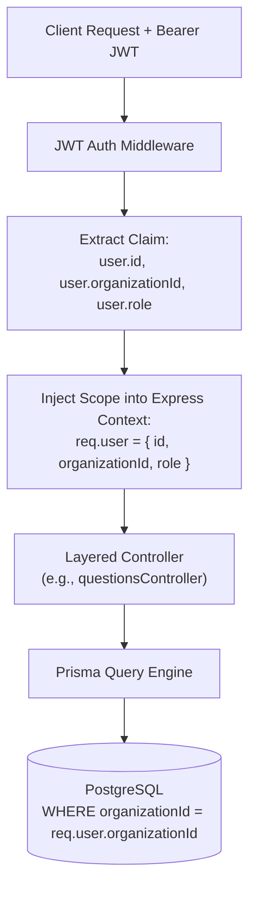
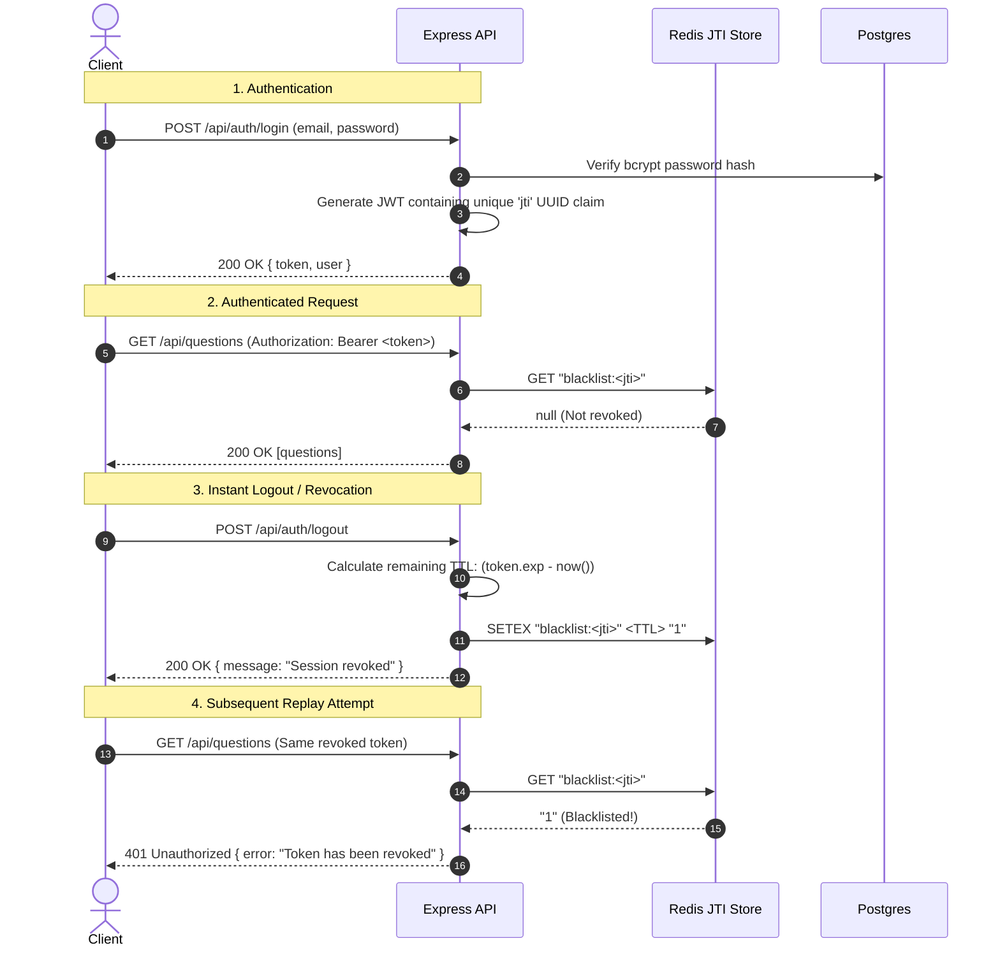

# Enterprise Security Architecture Whitepaper

This whitepaper details the defensive mechanisms, cryptographic controls, and identity management policies governing Question Forge.

---

## 1. Zero-Trust Multi-Tenancy Model

Question Forge implements **logical multi-tenancy** enforced at the middleware, controller, and query layers.



### Multi-Tenancy Invariants
1. **Query-Level Tenant Scoping**: Every database lookup, insertion, update, or deletion strictly includes `where: { organizationId: req.user.organizationId }`.
2. **Anti-IDOR Protection**: Insecure Direct Object References (e.g., supplying an external `paperId` or `questionId`) fail with `404 Not Found` because the query filters by both resource ID and tenant ID simultaneously.

---

## 2. Authentication & Instant Redis Token Revocation

Traditional stateless JWTs suffer from a well-known vulnerability: once issued, they cannot be revoked prior to expiration without maintaining a database state.

Question Forge resolves this via **Stateless JWTs with an Instant Redis JTI Blacklist**:



---

## 3. Role-Based Access Control (RBAC) Matrix

Users belong to an organization under one of three granular roles:

| Action / Resource | GENERATOR | REVIEWER | ADMIN |
|---|:---:|:---:|:---:|
| **Generate Question via AI** | ✅ | ✅ | ✅ |
| **View Organization Questions** | ✅ | ✅ | ✅ |
| **Edit Draft Question** | ✅ (Author only) | ✅ | ✅ |
| **Approve / Reject Question** | ❌ | ✅ | ✅ |
| **Bundle Assessment Papers** | ❌ | ✅ | ✅ |
| **Export to S3 (Candidate / Internal PDF)**| ❌ | ✅ | ✅ |
| **Configure Org Webhooks & Secrets** | ❌ | ❌ | ✅ |
| **Manage Users & Role Assignment** | ❌ | ❌ | ✅ |
| **View Queue & System Telemetry** | ❌ | ❌ | ✅ |

---

## 4. Input Sanitization & Anti-XSS Architecture

Because generated questions often contain HTML-sensitive characters (`<`, `>`, `&`, quotes in code snippets and explanations), unescaped rendering in headless browsers (Puppeteer) or web frontends presents severe Cross-Site Scripting (XSS) and Server-Side Request Forgery (SSRF) attack vectors.

### HTML Entity Sanitization Pipeline
Prior to PDF rendering or client transmission, all dynamic content passes through an entity encoder:

```typescript
export function sanitizeHtml(str: string): string {
  return str
    .replace(/&/g, '&amp;')
    .replace(/</g, '&lt;')
    .replace(/>/g, '&gt;')
    .replace(/"/g, '&quot;')
    .replace(/'/g, '&#x27;')
    .replace(/\//g, '&#x2F;');
}
```

Puppeteer browser instances are launched with hardened security flags:
```javascript
const browser = await puppeteer.launch({
  headless: 'new',
  args: [
    '--no-sandbox',
    '--disable-setuid-sandbox',
    '--disable-web-security=false',
    '--disable-remote-fonts',
  ],
});
```

---

## 5. Bring-Your-Own-Key (BYOK) Envelope Encryption

When organizations provide their own LLM API keys (OpenAI, Anthropic, Google Gemini), keys are never stored in plaintext. They are encrypted using **AES-256-GCM** with authenticated data:

```typescript
export function encryptApiKey(apiKey: string, masterKeyHex: string): EncryptedPayload {
  const iv = crypto.randomBytes(12); // 96-bit IV for GCM
  const cipher = crypto.createCipheriv('aes-256-gcm', Buffer.from(masterKeyHex, 'hex'), iv);
  
  let encrypted = cipher.update(apiKey, 'utf8', 'hex');
  encrypted += cipher.final('hex');
  const authTag = cipher.getAuthTag().toString('hex');
  
  return {
    iv: iv.toString('hex'),
    ciphertext: encrypted,
    authTag: authTag,
  };
}
```
The master encryption key is supplied via the `ENCRYPTION_KEY` environment variable and never written to database tables.
