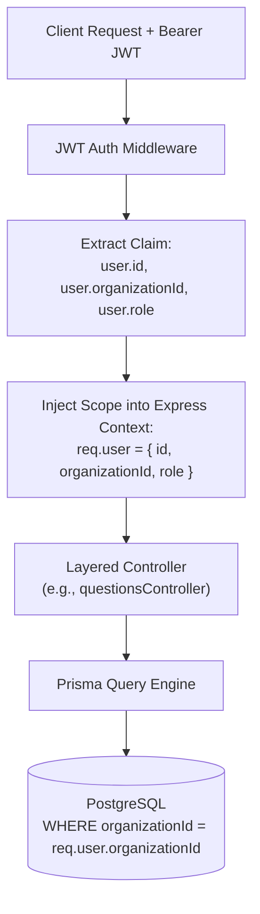
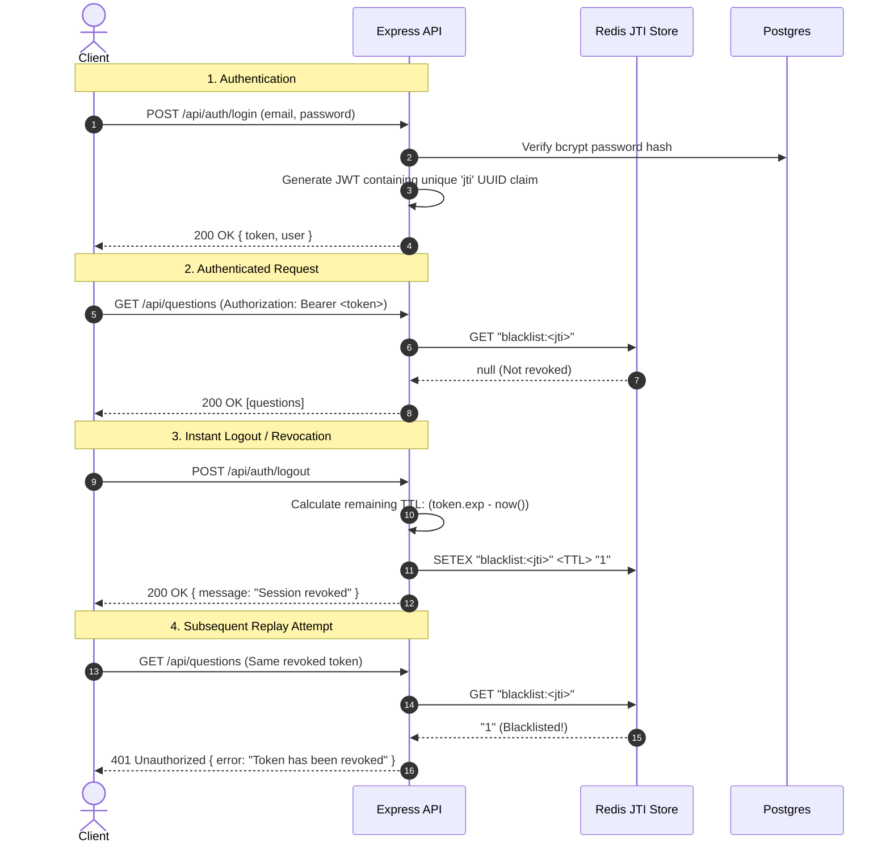
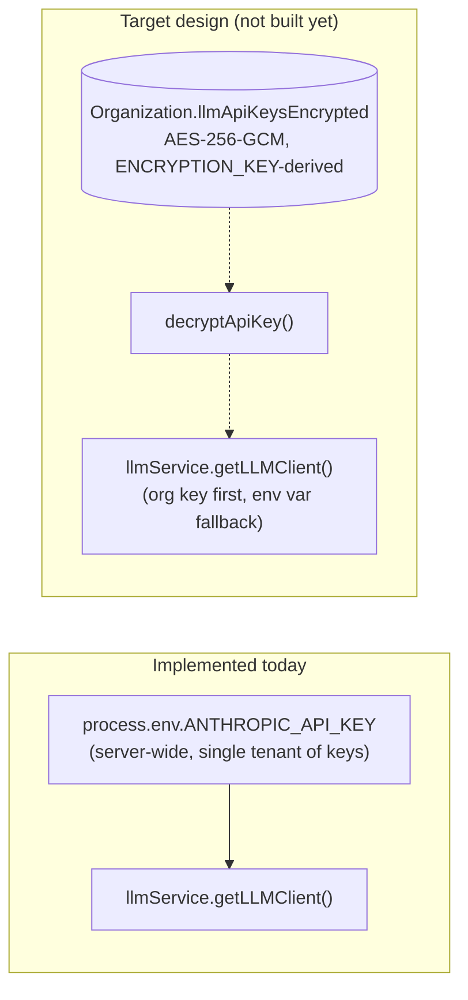

# Enterprise Security Architecture Whitepaper

This whitepaper details the defensive mechanisms, cryptographic controls, and identity management policies governing Question Forge.

---

## 1. Zero-Trust Multi-Tenancy Model

Question Forge implements **logical multi-tenancy** enforced at the middleware, controller, and query layers.


```mermaid
flowchart TD
    Client["Client Request + Bearer JWT"] --> AuthMid["JWT Auth Middleware"]
    
    AuthMid --> Extract["Extract Claim:\nuser.id, user.organizationId, user.role"]
    Extract --> Scope["Inject Scope into Express Context:\nreq.user = { id, organizationId, role }"]
    
    Scope --> Controller["Layered Controller\n(e.g., questionsController)"]
    Controller --> Prisma["Prisma Query Engine"]
    
    Prisma --> DB[("PostgreSQL\nWHERE organizationId = req.user.organizationId")]
```

### Multi-Tenancy Invariants
1. **Query-Level Tenant Scoping**: Every database lookup, insertion, update, or deletion strictly includes `where: { organizationId: req.user.organizationId }`.
2. **Anti-IDOR Protection**: Insecure Direct Object References (e.g., supplying an external `paperId` or `questionId`) fail with `404 Not Found` because the query filters by both resource ID and tenant ID simultaneously.

---

## 2. Authentication & Instant Redis Token Revocation

Traditional stateless JWTs suffer from a well-known vulnerability: once issued, they cannot be revoked prior to expiration without maintaining a database state.

Question Forge resolves this via **Stateless JWTs with an Instant Redis JTI Blacklist**:


```mermaid
sequenceDiagram
    autonumber
    actor User as Client
    participant API as Express API
    participant Redis as Redis JTI Store
    participant DB as Postgres

    Note over User,API: 1. Authentication
    User->>API: POST /api/auth/login (email, password)
    API->>DB: Verify bcrypt password hash
    API->>API: Generate JWT containing unique 'jti' UUID claim
    API-->>User: 200 OK { token, user }

    Note over User,API: 2. Authenticated Request
    User->>API: GET /api/questions (Authorization: Bearer <token>)
    API->>Redis: GET "blacklist:<jti>"
    Redis-->>API: null (Not revoked)
    API-->>User: 200 OK [questions]

    Note over User,API: 3. Instant Logout / Revocation
    User->>API: POST /api/auth/logout
    API->>API: Calculate remaining TTL: (token.exp - now())
    API->>Redis: SETEX "blacklist:<jti>" <TTL> "1"
    API-->>User: 200 OK { message: "Session revoked" }

    Note over User,API: 4. Subsequent Replay Attempt
    User->>API: GET /api/questions (Same revoked token)
    API->>Redis: GET "blacklist:<jti>"
    Redis-->>API: "1" (Blacklisted!)
    API-->>User: 401 Unauthorized { error: "Token has been revoked" }
```

---

## 3. Role-Based Access Control (RBAC) Matrix

Users belong to an organization under one of three granular roles:

| Action / Resource | GENERATOR | REVIEWER | ADMIN |
|---|:---:|:---:|:---:|
| **Generate Question via AI** | ✅ | ✅ | ✅ |
| **View Organization Questions** | ✅ | ✅ | ✅ |
| **Edit Draft Question** | ✅ (Author only) | ✅ | ✅ |
| **Approve / Reject Question** | ❌ | ✅ | ✅ |
| **Bundle Assessment Papers** | ❌ | ✅ | ✅ |
| **Export to S3 (Candidate / Internal PDF)**| ❌ | ✅ | ✅ |
| **Configure Org Webhooks & Secrets** | ❌ | ❌ | ✅ |
| **Manage Users & Role Assignment** | ❌ | ❌ | ✅ |
| **View Queue & System Telemetry** | ❌ | ❌ | ✅ |

---

## 4. Input Sanitization & Anti-XSS Architecture

Because generated questions often contain HTML-sensitive characters (`<`, `>`, `&`, quotes in code snippets and explanations), unescaped rendering in headless browsers (Puppeteer) or web frontends presents severe Cross-Site Scripting (XSS) and Server-Side Request Forgery (SSRF) attack vectors.

### HTML Entity Sanitization Pipeline

```mermaid
flowchart LR
    Input["User/LLM-authored content\n(statement, options, explanation, code)"] --> Sanitize["sanitizeHtml()\nescape & < > \" '"]
    Sanitize --> Branch{"Destination?"}
    Branch -- "PDF export" --> Puppeteer["Puppeteer\n(hardened launch flags)"] --> PDF(["Watermarked PDF -> S3"])
    Branch -- "API response" --> JSON(["JSON response to SPA\n(React escapes on render)"])
```

Prior to PDF rendering or client transmission, all dynamic content passes through an entity encoder:

```typescript
export function sanitizeHtml(str: string): string {
  return str
    .replace(/&/g, '&amp;')
    .replace(/</g, '&lt;')
    .replace(/>/g, '&gt;')
    .replace(/"/g, '&quot;')
    .replace(/'/g, '&#x27;')
    .replace(/\//g, '&#x2F;');
}
```

Puppeteer browser instances are launched with hardened security flags:
```javascript
const browser = await puppeteer.launch({
  headless: 'new',
  args: [
    '--no-sandbox',
    '--disable-setuid-sandbox',
    '--disable-web-security=false',
    '--disable-remote-fonts',
  ],
});
```

---

## 5. Bring-Your-Own-Key (BYOK): Schema-Ready, Not Yet Implemented

> **Status check:** `Organization.llmApiKeysEncrypted` exists in `schema.prisma` as a `Json?` column, and `ENCRYPTION_KEY` is a documented environment variable — but no code in `apps/api` currently reads, writes, or encrypts a per-organization key. Every LLM call today (`llmService.ts`) reads a single set of server-wide keys straight from `process.env.ANTHROPIC_API_KEY` / `OPENAI_API_KEY` / `GOOGLE_GEMINI_API_KEY`. Earlier drafts of this document described AES-256-GCM envelope encryption as if it were live; it wasn't, and this section now says so directly instead of documenting aspiration as fact.

The column and env var exist because this is the intended target design, and it's a contained addition when it's actually needed — an `encryptApiKey`/`decryptApiKey` pair using Node's `crypto.createCipheriv('aes-256-gcm', ...)`, a settings endpoint to write `llmApiKeysEncrypted`, and a change to `getLLMClient` to check the organization's decrypted key before falling back to the server-wide env var:


```mermaid
flowchart LR
    subgraph Today ["Implemented today"]
        Env["process.env.ANTHROPIC_API_KEY\n(server-wide, single tenant of keys)"] --> LLM1["llmService.getLLMClient()"]
    end

    subgraph Target ["Target design (not built yet)"]
        OrgKey[("Organization.llmApiKeysEncrypted\nAES-256-GCM, ENCRYPTION_KEY-derived")] -.-> Decrypt["decryptApiKey()"] -.-> LLM2["llmService.getLLMClient()\n(org key first, env var fallback)"]
    end
```

Until that's built, treat `ENCRYPTION_KEY` and `llmApiKeysEncrypted` as reserved, not active.
